# 01.ARMv8 아키텍쳐_명령어와 레지스터

### 간단한 어셈블리 코드 분석과 ARM 아키텍쳐/주요 명령어

 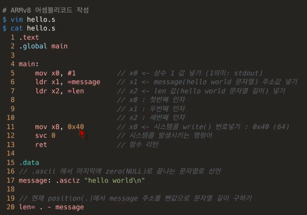✔️ 사용자 프로그램이 디스크 파일을 접근하거나 화면에 결과를 출력하는 등의 작업이 필요한 경우, 즉 **사용자 프로그램이 특권 명령의 수행을 필요로 하는 경우, 운영체제에게 특권 명령의 대행을 요청하는 것**이 `시스템 콜`

✔️ 메모리 인스트럭션 이해하기

- *인스트럭션*(instruction)은 컴퓨터에게 일을 시키는 단위로서, 컴퓨터가 알아들을 수 있는 기계어로 이루어져 있는 명령

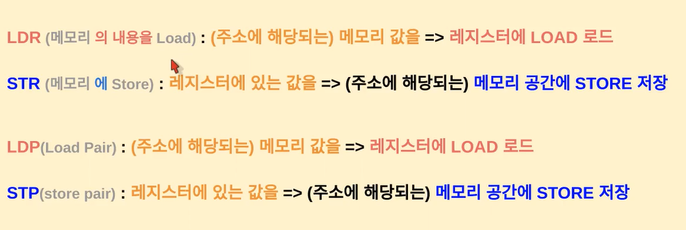

LDR, STR같이 R로 끝나는건 레지스터에 뭘 한다는 뜻

LDP, STP의 P는 **Pair** / SP -> Stack Point

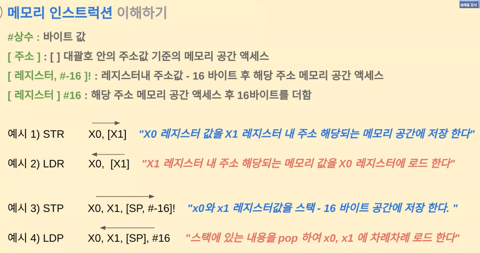

##### 기본 인스트럭션 이해하기

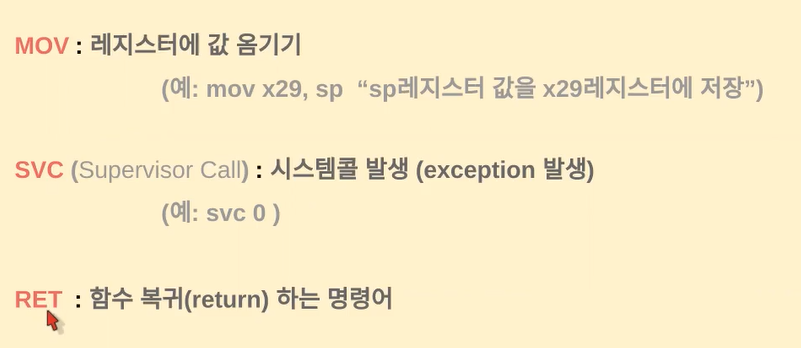

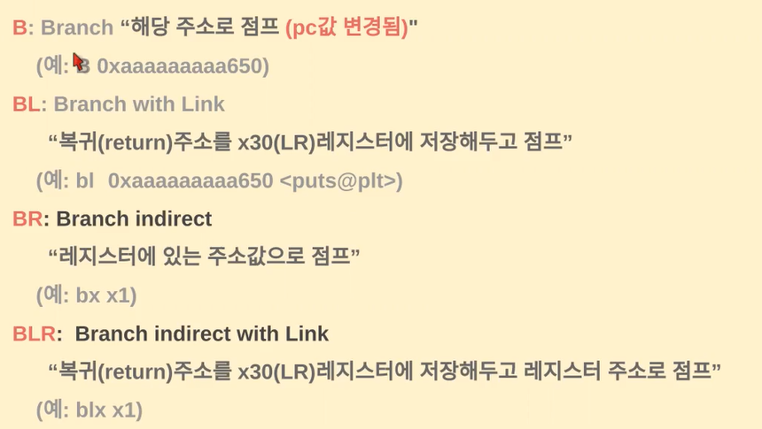 

### ABI 개념과 ARMv8 레지스터

ABI(Application Binary Interface): OS, CPU, 컴파일러등 ... 이 함께 바이너리를 어떻게 맞출지 약속

- 가상메모리

- ELF (바이너리 포매)

- 시스템 콜 넘버

- 함수 호출 규약 ...

##### ARMv8 주요 레지스터

레지스터: 휘발성으로 데이터를 저장하는 공간

- 휘발성 덕분에 프로그램을 메모리에 올렸다가 CPU에서 실행하면 굉장히 빨리 처리할 수 있음

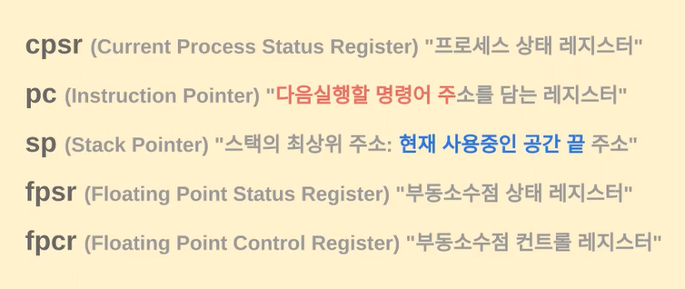

pc == program counter (다음 실행할 명령어 주소 담고 있음)

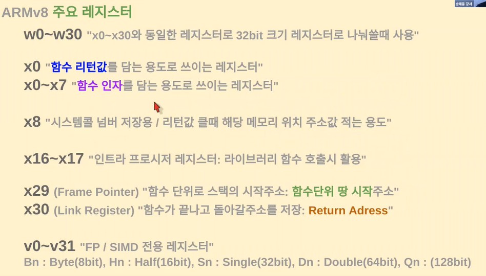

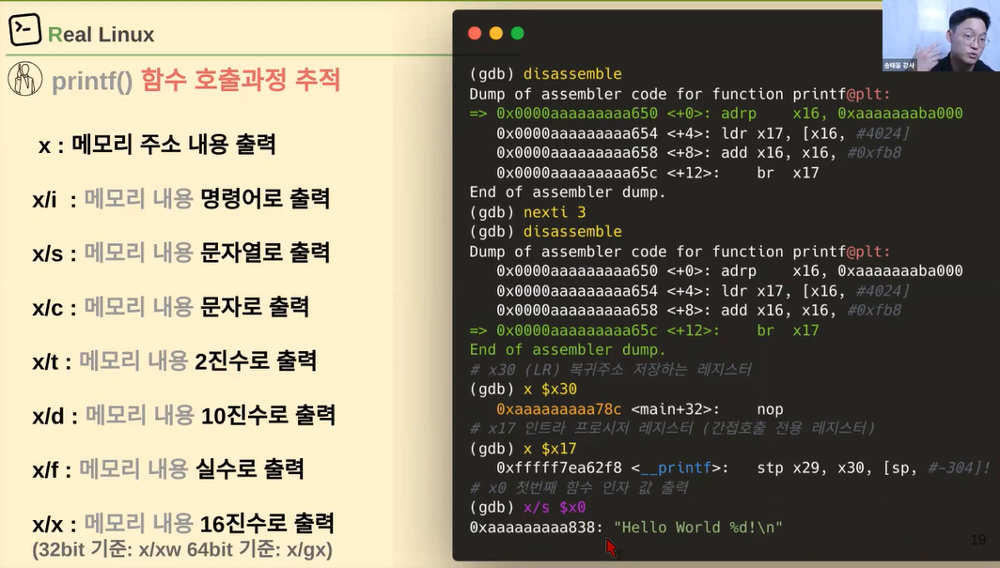

 

## Stack 메모리 추적과 분석

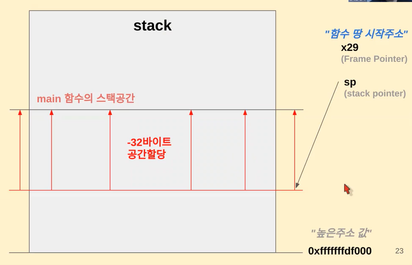

 stack -> 주소 값이 높음

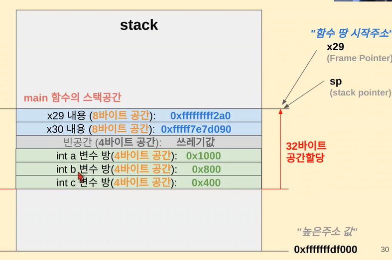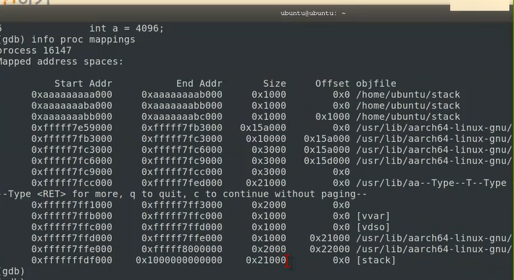

