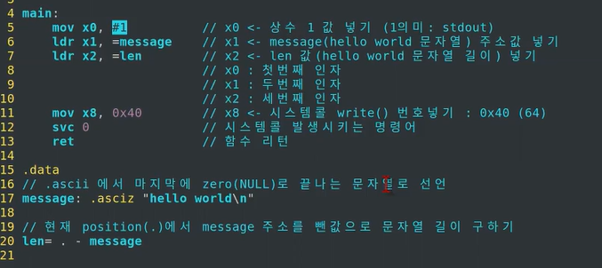

# 01.ARMv8 아키텍쳐_명령어와 레지스터

### 간단한 어셈블리 코드 분석과 ARM 아키텍쳐/주요 명령어

 

✔️ 메모리 인스트럭션 이해하기

- *인스트럭션*(instruction)은 컴퓨터에게 일을 시키는 단위로서, 컴퓨터가 알아들을 수 있는 기계어로 이루어져 있는 명령

 LDP, STP의 P는 **Pair** SP -> Stack Point

##### 기본 인스트럭션 이해하기

 

### ABI 개념과 ARMv8 레지스터

