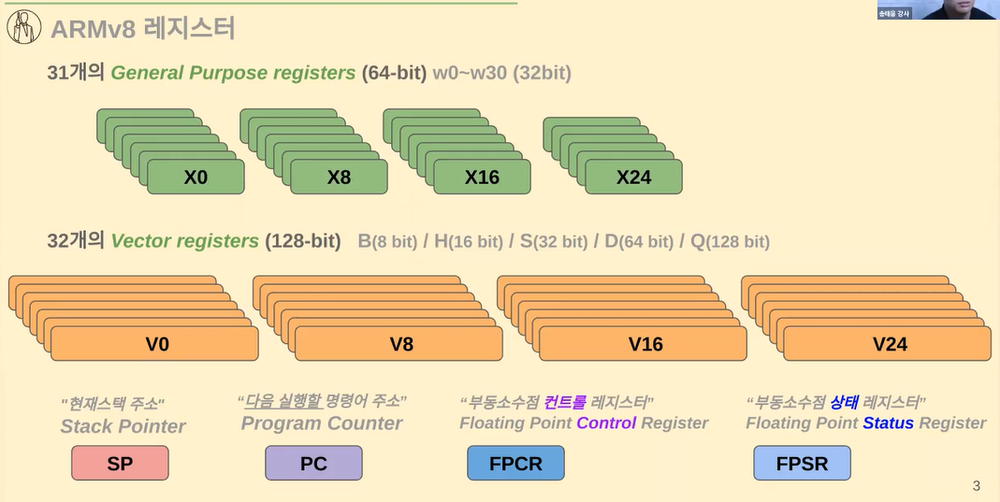
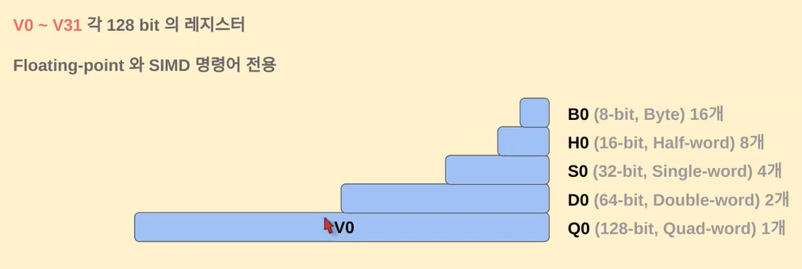
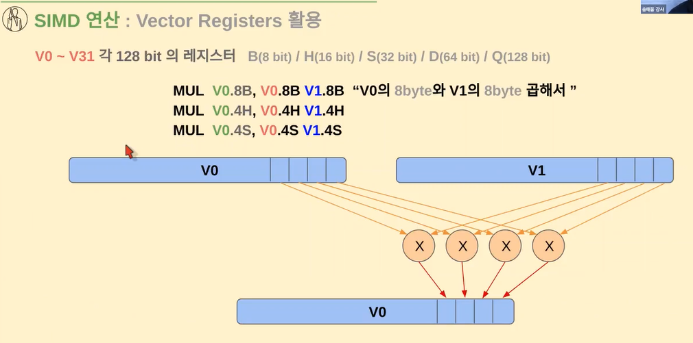
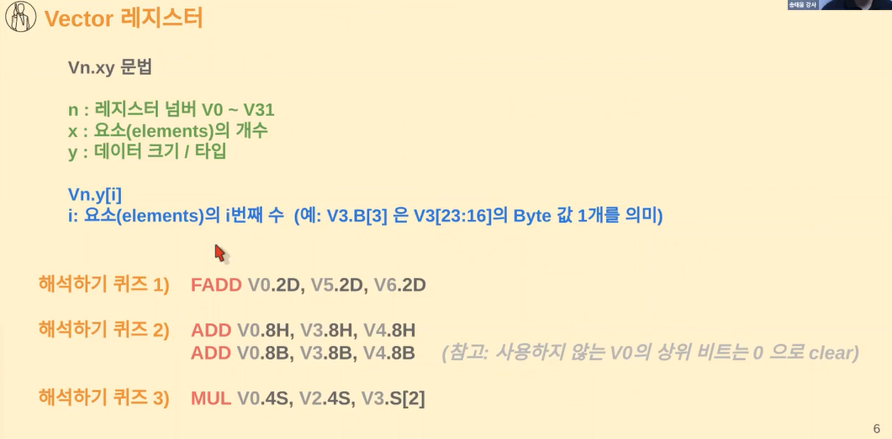
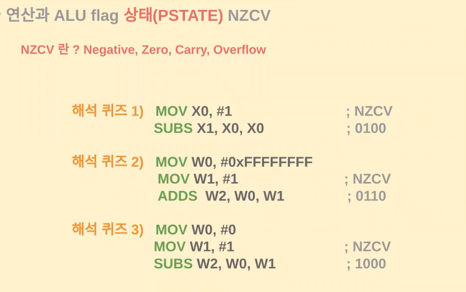

# 02.FP와 SIMD

### NEON SIMD, FP 와 vector 레지스터

`Neon`: SIMD(Single Instruction Multiple Data) 데이터 처리 엔진

v0 ~ v31 레지스터 활용, 배열 등 여러 개의 데이터 처리의 병렬화

> ✔️ `neon`은 ARM 아키텍처의 SIMD(Single Instruction, Multiple Data) 명령어 세트로, 벡터화된 연산을 지원하는 기능 ➡️ 즉, **하나의 명령어로 여러 개의 데이터를 동시에 처리할 수 있는 것을 의미**

> **v0 ~ v31 레지스터 활용**이라는 표현은, neon 명령어를 사용하여 수행되는 연산을 나타내기 위해 벡터 레지스터를 지칭하는 것  ARM neon 아키텍처에서는 총 32개의 128비트 SIMD 벡터 레지스터가 있는데, 이들은 각각 v0부터 V31까지의 이름을 가지고 있습니다.

> 예를 들어, vadd.f32 v0, v1, v2는 neon 명령어 중 하나로, v1과 v2 벡터 레지스터의 각 요소들을 더해서 그 결과를 v0 레지스터에 저장합니다. 이것은 실수(float) 형태의 32비트 요소에 대해 동작합니다.

> 따라서 "neon이 v0 ~ V31 레지스터 활용"이라는 문장은, neon SIMD 명령어를 사용하여 벡터화된 연산을 수행할 때, 결과와 중간값들이 v0부터 V31까지의 레지스터에 저장된다는 것을 나타냄

##### 💡 그럼 이게 왜 필요할까?

ARM은 32비트 프로세서 (AArch32)에서 현재는 64비트 프로세서 모드(AArch64)를 지원하고 있다. 이게 무슨 말이냐 하면, 한번에 다루는 Data의 Address나 크기가 32bit혹은 64bit까지 한꺼번에 다루는 것이 가능하다는 뜻  

그런데 문제는, 많은 경우에 (특히 멀티미디어 관련 - 이를 테면 오디오 코덱 이나 그래픽 관련에서 함수들) 이것 보다 작은 크기의 데이터를 대량으로 다루는 경우가 많다 😭 

가령 이런 함수에서 많은 양의 8비트 데이터를 엄청나게 연산해야 하는데, CPU는 한꺼번에 64비트를 처리할 능력이 있는데, 고작? 8비트의 데이터를 복사 혹은 연산하기 위해서 한개 인스트럭션을 소모해야 한다면, CPU를 효율적으로 사용하고 있다고 말하기 힘들다...

이런 비효율의 문제를 해결하기 위해서, ARM社에서는 ARMv6에 <mark>작은 크기에 데이터를 여러개 처리하도록 해주는 기본적인 SIMD 명령어</mark>를 추가하게 된다. 이때는 8비트 혹은 16bit로 값들을 generic purpose register에 packed한 형태로 연산하도록 지원을 했었고, ARMv7이후에는 이 개념을 더 확장해서 이런 operation을 위해서 vector register를 두고, 명령어 세트와 해당 Architecture를 합쳐서 `네온(NEON)` 이라고 부르게 된다. 현재는 모든 Cortex-A 프로세서에서 지원하고 있다!

`FP`: Floating-point 부동소수점(실수)

VFP(Vector Floating-Point) 부동소수점 계산을 위한 하드웨어 가속기

NEON 기반으로 부동소수점 (병렬)연산 처리

##### 💡부동소수점?

컴퓨터에서 숫자를 표현할 때, 정수와 소수 부분을 나누어 저장해야 한다. 이 때, 실수를 다루기 위한 방식을 **부동소수점**이라고 함. 부동소수점은 소수점 위치를 움직여가며 숫자를 표현하는 방식입니다.

ARM 프로세서에서는 부동소수점 연산을 더 빠르고 효율적으로 처리하기 위해 "VFP"와 "NEON"이라는 두 가지 기술을 사용

1. **VFP (Vector Floating-Point):** 이는 부동소수점 연산을<mark> 더 빠르게 처리</mark>하기 위한 <mark>하드웨어 가속기</mark> "Vector"라는 단어는 한 번에 여러 개의 데이터를 처리하는 것을 의미 VFP는 실수 계산을 효율적으로 하기 위한 하드웨어 부분이다.

2. **NEON SIMD (Single Instruction, Multiple Data):** NEON은 벡터화된 연산을 지원하는 기술로, <mark>한 번의 명령어로 여러 데이터를 동시에 처리</mark>할 수 있다. 이것은 실수 연산을 비롯한 다양한 연산을 효율적으로 처리하는 데 사용된다.

✔️ **VFP는 주로 실수 연산에 특화되어 있고 개별 연산을 더 빠르게 처리하는 데 초점**을 맞추었으며, **NEON은 SIMD 기술을 활용하여 여러 종류의 데이터 연산을 병렬로 처리하여 더 효율적인 연산을 실현**

➡️ 따라서 ARM 프로세서에서 부동소수점 계산을 더 빠르고 효율적으로 처리하기 위해 VFP와 NEON을 함께 사용하며, NEON을 통해 병렬로 여러 연산을 처리할 수 있다. 이로써 속도와 효율성이 향상되며, 실시간 그래픽 처리나 과학/공학 연산 등에 많이 활용된다.

> **레지스터?**
> 
> 프로세서 내부에 위치한 작은 크기의 **메모리 유닛**
> 
> 레지스터는 프로세서가 데이터를 임시로 저장하고 연산을 수행하는 데 사용되며, 매우 빠른 속도로 데이터에 접근할 수 있음 CPU의 동작을 조정하고 명령어를 실행하기 위한 데이터 저장소로 볼 수 있습니다.

➡️ 레지스터 어떻게 사용할지에 대한 컨벤션

➡️ B0, H0, S0, D0, Q0 다 똑같은 V0레지스터인데 더 나눠서 쓰는거임

B0가 하나의 이름임 (V0에 있으면 0 이 숫자는 똑같은듯)

✔️ 해석이 중요해!

- MUL V0.8B, V0.8B V1.8B 
  
  - MUL은 곱하기 / 오른쪽에서 왼쪽으로 읽는다
  
  - V0와 V1에 있는 레지스터 값을 곱해서 V0에 넣겠다

- 오른쪽에서 왼쪽으로 읽는다

- FADD 포인트 연산..? 실수값이 들어간다는 뜻인데 아무튼 ADD임

💡 `NZCV`는 ARM 아키텍처에서 상태 레지스터(Status Register)의 네 가지 비트를 나타내는 약어 이 네 가지 비트는 조건부 실행과 같은 프로세서 동작을 제어하고, 연산 결과의 상태를 나타내는 데 사용됨

1. **N (Negative):** 이 비트는 연산 결과가 음수인지 나타냄 연산 결과가 음수면 N 비트가 1로 설정

2. **Z (Zero):** 연산 결과가 0인 경우 Z 비트가 설정됨 결과가 0이면 Z 비트가 1로 설정

3. **C (Carry):** 이 비트는 덧셈이나 뺄셈 연산에서 발생하는 "캐리"를 나타냄 만약 캐리가 발생하면 C 비트가 1로 설정

4. **V (Overflow):** 이 비트는 부호 있는 정수 연산에서 발생하는 "오버플로우"를 나타냄 만약 오버플로우가 발생하면 V 비트가 1로 설정

이 네 가지 비트는 프로세서가 연산을 수행하고 그 결과를 평가하는 데 사용됨

예를 들어, 조건 분기 명령어에서는 N, Z, C, V 비트를 검사하여 특정 조건이 충족되었는지 확인하고, 이에 따라 프로그램 흐름을 결정할 수 있다. 상태 레지스터는 프로세서 동작의 결정에 중요한 역할을 하며, 프로그래밍에서 조건부 실행과 에러 처리 등에 활용

💡 해보기

> **MOV X0, #1**
> **SUBS X1, X0, X0**

1. **MOV X0, #1:** 이 명령어는 레지스터 X0에 숫자 1을 저장하는 역할 즉, X0 레지스터에 1이 저장

2. **SUBS X1, X0, X0:** 이 명령어는 X0 레지스터의 값과 X0 레지스터의 값을 뺀 결과를 X1 레지스터에 저장하면서, 동시에 연산 결과의 상태를 조사
   
   - **SUBS:** 두 개의 값을 빼는 명령어
   - **X1:** 연산 결과를 저장할 대상 레지스터
   - **X0, X0:** 두 번째와 세 번째 인자는 빼기 연산에 사용될 레지스터 여기서는 레지스터 X0의 값에서 X0의 값(즉, 1)을 빼게 됨

이때, 뺀 결과는 0이 되므로 X1 레지스터에 0이 저장 또한, 이 SUBS 명령어는 뺀 결과를 기준으로 네 가지 상태 비트(N, Z, C, V)를 설정

- **N (Negative):** 뺀 결과가 0보다 작기 때문에 N 비트는 1로 설정
- **Z (Zero):** 뺀 결과가 0이기 때문에 Z 비트는 1로 설정
- **C (Carry):** 빼기 연산에서 캐리가 발생하지 않았기 때문에 C 비트는 0으로 설정
- **V (Overflow):** 빼기 연산에서 오버플로우가 발생하지 않았기 때문에 V 비트는 0으로 설정

결과적으로 X1에는 0이 저장되고, 상태 비트들은 위와 같이 설정됨

 

### SIMD(벡터연산)과 Floating-point 연산 추적과 분석

