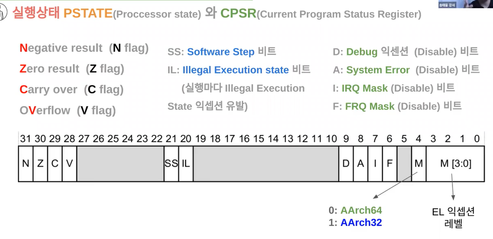
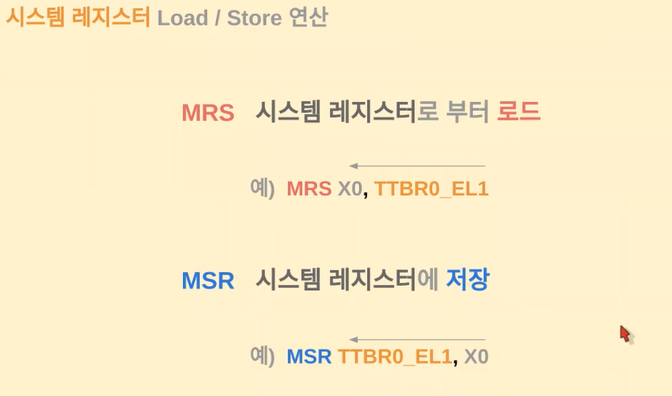
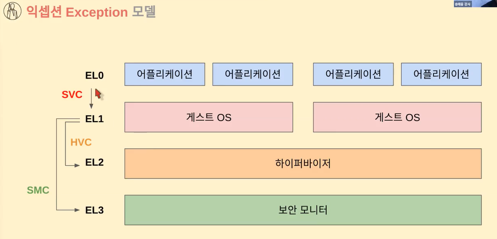
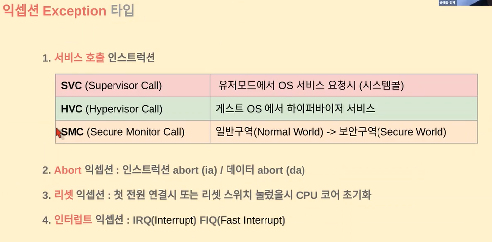
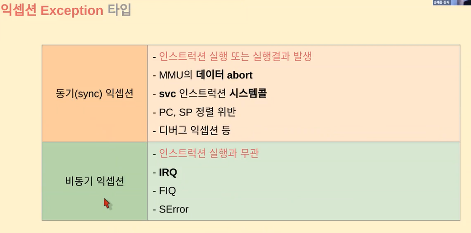
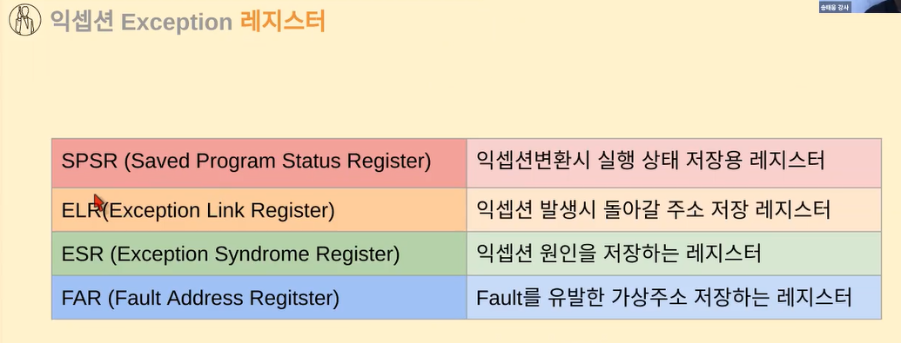
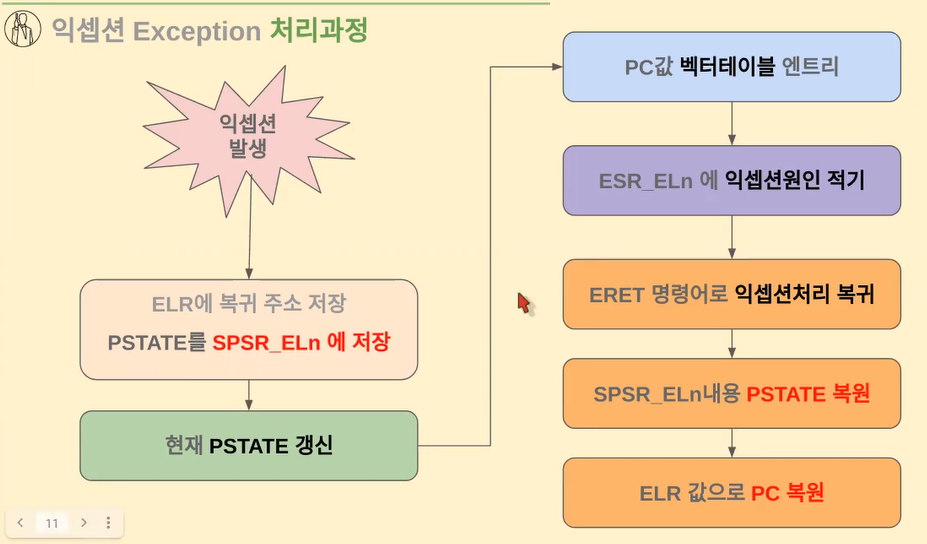
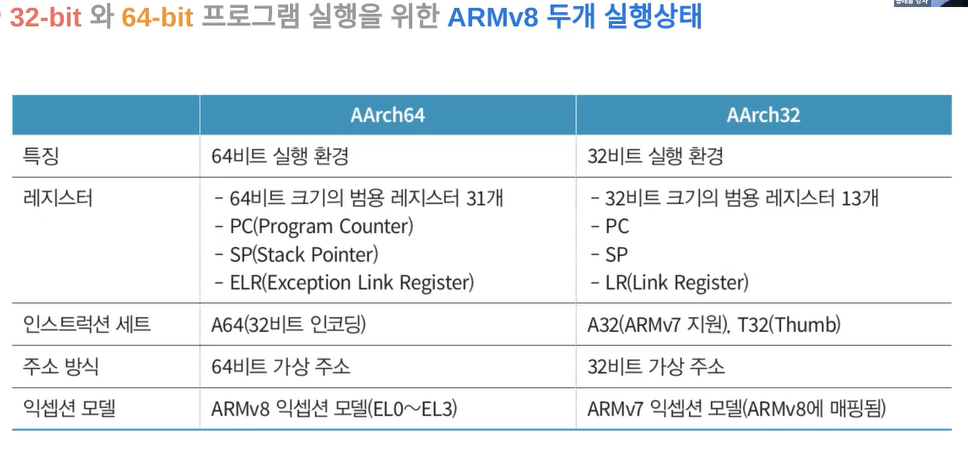
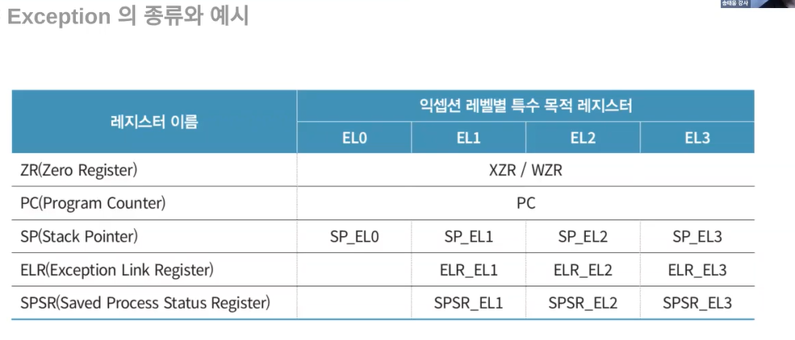
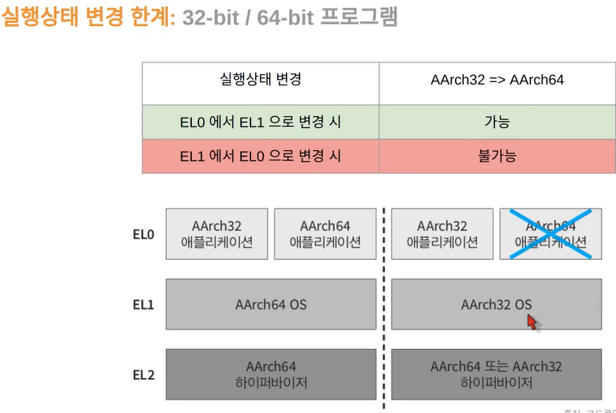

# 03. AArch64 예외(Exception) 32/64 bit 프로그램

### 상태레지스터(cpsr)와 익셉션(Exception) 모델

💡 `PSTATE`와 `CPSR`은 ARM 아키텍처에서 사용되는 <mark>상태 레지스터들을 나타내는 용어</mark>
이 두 레지스터는 <u>프로세서의 실행 상태와 제어 정보를 포함, 프로그램의 실행 동안 다양한 상태 정보를 유지하고 제어하는 데 사용됨</u>

✔️ 4번째 비트를 기준으로 32비트인지 64비트인지 나눔

1. **PSTATE (Processor State Register):** PSTATE은 ARMv8 아키텍처에서 사용되는 상태 레지스터 이 레지스터는 <mark>현재 프로세서의 실행 상태와 제어 정보를 저장</mark>하며, 다양한 비트 필드로 구성되어 있다. 주요한 PSTATE 비트는 다음과 같다
   
   - **NZCV (Negative, Zero, Carry, Overflow):** PSTATE에는 <mark>연산 결과의 상태 정보</mark>를 나타내는 네 가지 비트가 있다. 이 비트들은 연산 결과에 따라 설정되며, 조건 분기와 같은 제어 흐름 결정에 사용됨
   - **DAIF (Interrupt Mask Bits):** PSTATE에는 <mark>인터럽트 처리를 제어</mark>하는 인터럽트 마스크 비트들이 포함되어 있음
   - **SPSEL (Stack Pointer Select):** 현재 스택 포인터가 어떤 스택을 가리키는지를 나타내는 비트
   - **Mode Bits:** 실행 중인 프로세서의 모드(사용자 모드, 시스템 모드 등)를 지정하는 비트들이 있음

2. **CPSR (Current Program Status Register):** CPSR은 이전 ARM 아키텍처 버전인 ARMv7 및 이전 버전에서 사용되는 상태 레지스터
   CPSR은 PSTATE와 유사한 목적을 가지며, 현재 프로세서의 실행 상태와 제어 정보를 저장. CPSR도 비트 필드로 구성되어 있으며, 주요 비트는 다음과 같다
   
   - **N, Z, C, V:** 연산 결과의 상태 정보를 나타내는 네 가지 비트
   - **I, F:** 인터럽트 및 FIQ(빠른 인터럽트 요청)를 비활성화하는 비트
   - **Thumb/ARM Mode:** 현재 프로세서의 실행 모드를 지정하는 비트 Thumb 모드는 16비트 명령어를 사용하는 모드로, ARM 모드는 32비트 명령어를 사용하는 모드

✔️ PSTATE과 CPSR은 ARM 아키텍처에서 현재 프로세서의 실행 상태, 연산 결과의 상태 정보, 인터럽트 처리 등을 관리하기 위한 중요한 레지스터이다 ARMv8에서는 PSTATE을 사용하며, 이전 버전에서는 CPSR을 사용

💡 `MRS`와 `MSR`은 ARM 아키텍처에서 상태 레지스터(State Register)의 값을 읽어오거나 설정하기 위한 명령어

1. **MRS (Move to Register from Status/Control Register):**
   
   - MRS 명령어는 상태 레지스터의 값을 레지스터에 복사하는 역할
   - 주로 제어 상태 레지스터(PSTATE) 또는 상태 관련 <mark>레지스터의 값을 읽어올 때 사용</mark>
   - 예를 들어, "MRS X0, NZCV"는 PSTATE 레지스터의 NZCV 필드 값을 X0 레지스터에 복사함

2. **MSR (Move to Status/Control Register from Register):**
   
   - MSR 명령어는 레지스터의 값을 상태 레지스터에 복사하거나 설정하는 역할
   - 주로 제어 상태 레지스터(PSTATE) 또는 상태 관련 <mark>레지스터의 값을 설정할 때 사용</mark>
   - 예를 들어, "MSR NZCV, X1"은 X1 레지스터의 값을 PSTATE 레지스터의 NZCV 필드에 복사함

MRS와 MSR 명령어를 사용하여 상태 레지스터 값을 조작하면서, 프로세서의 실행 상태나 제어 정보를 읽거나 설정할 수 있음 이는 프로세서의 동작을 제어하거나 예외 처리와 같은 작업을 수행할 때 중요한 역할을 함!

💡 `EL0` `EL1` `EL2` `EL3`은 ARMv8-A 아키텍처의 예외 레벨(Exception Level)을 나타내는 용어 

각각의 예외 레벨은 프로세서의 **특정 운영 모드**를 나타내며, 시스템 소프트웨어 및 응용 프로그램이 서로 다른 권한과 권한 모드에서 동작할 수 있도록 하는 것을 가능하게 함. 이 레벨은 ARMv8 아키텍처에서 프로세서의 보호, 가상화, 보안 및 예외 처리를 위한 중요한 구성 요소임

1. **EL0 (Exception Level 0) ⭐**
   
   - 가장 낮은 예외 레벨로, 사용자 모드 또는 애플리케이션 모드를 나타냄
   - 주로 응용 프로그램이 동작하는 레벨로, 일반적인 사용자 작업을 수행하는 코드가 실행됨
   - 최소한의 권한을 가지며, 시스템 레지스터 및 특권 명령어에 접근할 수 없음

2. **EL1 (Exception Level 1) ⭐**
   
   - 커널 모드 또는 슈퍼바이저 모드를 나타냄
   - 주로 운영 체제 커널이 실행되는 레벨로, 시스템 관리와 예외 처리를 수행함
   - 다양한 권한을 가지며, 시스템 레지스터 및 특권 명령어에 접근할 수 있음

3. **EL2 (Exception Level 2)**
   
   - 하이퍼바이저 모드를 나타냄
   - 가상화 관련 작업을 수행하는 레벨로, 가상 머신을 관리하고 가상 머신 사이의 리소스를 분배함
   - EL1보다 높은 권한을 가지며, 가상화 지원 관련 명령어와 시스템 레지스터에 접근할 수 있음

4. **EL3 (Exception Level 3)**
   
   - 펌웨어 모드를 나타냄
   - 부트 로더와 부트 펌웨어가 실행되는 레벨로, 부트 시스템 초기화 작업을 수행함
   - 다른 예외 레벨보다 높은 권한을 가지며, 보안 초기화 및 부팅 관련 작업을 수행할 수 있음

이렇게 다양한 예외 레벨은 시스템의 보안과 가상화를 강화하며, 다양한 권한과 권한 모드에서 소프트웨어가 동작할 수 있도록 지원함!

##### 💡ARM 아키텍처에서 사용되는 예외와 관련된 용어

1. **서비스 호출 인스트럭션 (Service Call Instructions)**
   
   - **SVC (Supervisor Call):** 이 명령어는 슈퍼바이저 모드에서 응용 프로그램이 시스템 함수를 호출할 때 사용 (슈퍼바이저모드: 일반적으로 운영 체제의 서비스나 시스템 호출을 처리하는 데 사용)
   - **HVC (Hypervisor Call):** 이 명령어는 하이퍼바이저 모드에서 사용, 하이퍼바이저가 시스템 호출을 처리하는 데 사용 (하이퍼바이저모드: 가상화 환경을 관리하고 다른 운영 체제나 가상 머신을 실행)
   - **SMC (Secure Monitor Call):** 이 명령어는 보안 환경에서 사용, 안전한 모니터나 트러스트존과 같은 보안 모듈을 호출하는 데 사용

2. **Abort 익셉션**
   
   - 프로세서가 부정확한 명령어를 수행하거나 잘못된 메모리 영역에 접근하면 발생하는 예외  이는 데이터 중첩 오류(Domain Fault), 인스트럭션 중첩 오류(Instruction Fault), 혹은 스택 오버플로우(Stack Overflow) 등을 포함

3. **리셋 익셉션**
   
   - 프로세서를 초기화하고 시작하기 위해 발생하는 예외 보통 시스템 초기화나 부트 프로세스 시작 시에 사용 

4. **인터럽트 익셉션**
   
   - 외부 장치나 시스템 요구에 응답하여 발생하는 예외로, 프로세서의 실행 흐름을 변경하여 인터럽트 서비스 루틴을 실행
   - 예를 들어, 타이머 인터럽트나 입출력 장치로부터의 인터럽트가 여기에 속함
   - IRQ, FIQ로 나눔 (FIQ가 더 빠름)

이러한 예외들은 프로세서의 실행 중에 발생하는 상황에 따라 다양한 동작을 수행하도록 설계되어 있음 예외 처리는 프로세서의 안정성과 예측 가능성을 유지하는 데 중요한 역할을 함!

**동기 익셉션 (Synchronous Exception):**

- 동기 예외는 명령어의 실행으로 인해 발생하며, 예외가 발생한 명령어 다음에 처리됨
- 예를 들어, 부정확한 연산을 수행하거나 잘못된 메모리 영역에 접근하면 "Abort 예외"가 발생하며, 해당 명령어 다음에 예외 처리가 진행
- 동기 예외는 명령어의 실행 흐름을 제어하여 예외 처리를 수행하므로, 처리 결과가 예측 가능

**비동기 익셉션 (Asynchronous Exception):**

- 비동기 예외는 명령어의 실행과는 상관없이 발생하며, 현재 실행 중인 명령어와 관련이 없는 경우에도 예외가 발생
- 주로 외부 인터럽트나 하드웨어 이벤트로 인해 발생, 실행 중인 명령어의 어느 지점에서든 예외 처리가 시작될 수 있음
- 비동기 예외는 예측하기 어려운 순간에 발생하므로, 실행 중인 명령어의 상태와 관련된 예외 처리를 조심스럽게 수행해야 함!

ELn -> EL0 EL1 EL2 ....  (n은 숫자)

##### **💡 익셉션 처리 과정**

1. **예외 발생**
   
   - 예외는 동기적 또는 비동기적으로 발생할 수 있음 동기 예외는 명령어 실행 결과로 발생하고, 비동기 예외는 외부 인터럽트 등에 의해 발생

2. **ELR에 복귀 주소 저장**
   
   - 예외 발생 시 다음 명령어의 주소인 복귀 주소를 ELR (Exception Link Register)에 저장 이렇게 하면 예외 처리 후에 정확한 위치로 복귀할 수 있음

3. **PSTATE를 SPSR_ELn에 저장**
   
   - 현재 실행 중인 프로세서 상태 (PSTATE)를 해당 예외 레벨의 SPSR (Saved Program Status Register)에 저장. 이는 예외 처리가 끝나면 이전 상태로 돌아갈 수 있도록 하는 것

4. **현재 PSTATE 갱신**
   
   - 예외 처리 모드로 전환될 때, 현재의 PSTATE를 적절한 예외 처리 모드의 설정으로 갱신

5. **PC 값 벡터 테이블 엔트리**
   
   - 예외 처리 과정은 예외 유형에 따라 벡터 테이블의 특정 엔트리로 이동함. 이 엔트리는 해당 예외에 대한 처리 코드의 시작 위치를 가리키며, 처리 코드를 실행

6. **ESR_ELn에 익셉션 원인 기록**
   
   - 예외가 발생한 원인을 나타내는 정보를 ESR_ELn (Exception Syndrome Register)에 저장 이 정보는 예외 원인을 분석하고 처리하는 데 도움을 줌

7. **ERET 명령어로 익셉션 처리 복귀**
   
   - 예외 처리 코드가 완료되면 ERET 명령어를 사용하여 예외 처리 모드에서 이전 실행 모드로 복귀

8. **SPSR_ELn 내용 복원**
   
   - ERET 명령어 실행 시 SPSR_ELn에 저장된 이전 실행 상태를 PSTATE로 복원

9. **ELR 값으로 PC 복원**
   
   - ERET 명령어 실행으로 ELR에 저장된 복귀 주소를 PC(Program Counter)로 복원함이에 따라 이전 실행 지점으로 복귀
   - PC에 있는 값이 실행되기 때문에 PC값만 바꾸면 내가 원하는 코드를 수정할 수 있다는 뜻 (물론 중간에 보안절차가 있어서 마음대로 막막 하지는 못하겠지만,,)

 

### ARMv8 32-bit/64-bit 프로그램 실행

32비트 환경에서 64비트 구동안됨

