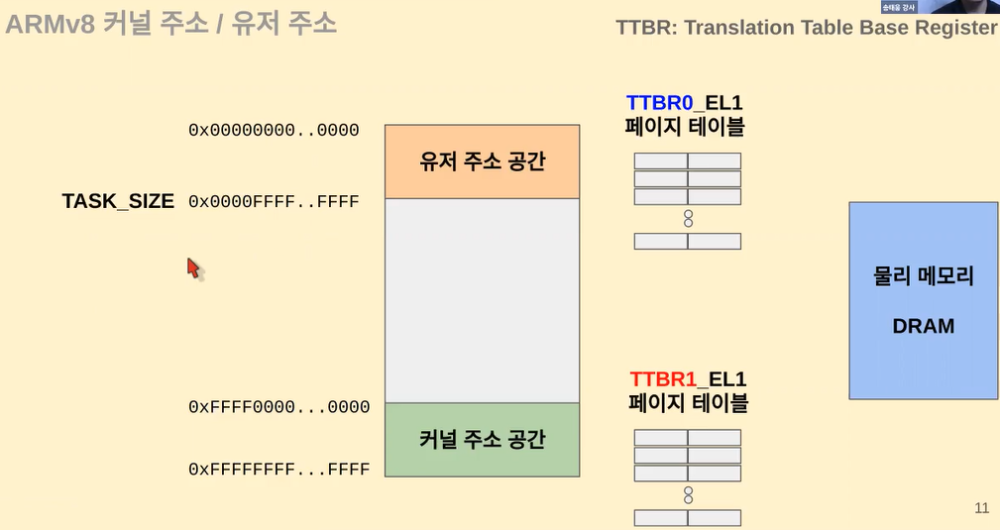
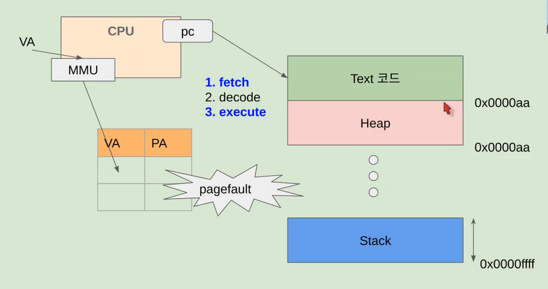
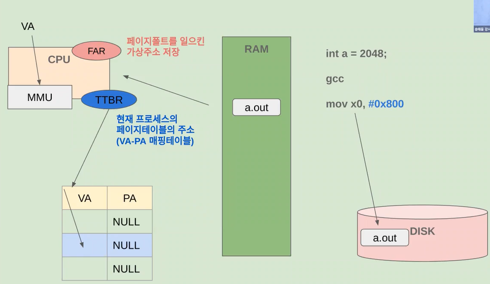

# 04. ARMv8 메모리 액세스 과정 분석

### 가상주소 (Virtual Address) 범위 user/kernel

TASK_SIZE보다 즉, 유저가 쓰는 공간보다 크면 커널 주소라고 판단

`가상주소(Virtual Address)`는 컴퓨터 시스템에서 사용되는 개념으로, 주로 메모리 관리와 프로세스 간의 격리를 위해 활용

- 가상주소는 실제 물리적인 메모리 주소와는 별도로 사용되며, 프로세스가 메모리를 사용할 때 물리적인 메모리 주소와 매핑되어 접근

가상주소 범위는 일반적으로 다음과 같은 세 가지 주요 영역으로 나뉘어짐

1. **코드(Code) 영역**: 프로그램의 실행 코드가 저장되는 영역. 이 영역은 실행 파일의 명령어들이 위치하며, 프로세스가 이 코드를 실행할 때 필요한 명령어들을 가져와 실행함

2. **데이터(Data) 영역**: 프로그램의 전역 변수나 정적 변수와 같은 데이터가 저장되는 영역. 이 영역은 프로그램의 상태와 데이터를 저장하며, 프로세스가 데이터에 접근하여 읽거나 쓸 수 있음

3. **스택(Stack) 영역**: 함수 호출과 관련된 지역 변수와 반환 주소 등이 저장되는 영역. 함수가 호출될 때마다 스택에 새로운 프레임이 추가되며, 함수가 반환되면 해당 프레임이 제거됨. 이를 통해 프로그램의 실행 흐름과 지역 변수의 생명주기를 관리

가상주소를 사용하면 여러 프로세스가 동시에 실행될 때 각 프로세스는 독립적으로 자신만의 가상주소 공간을 가질 수 있음 이렇게 함으로써 각 프로세스는 자신만의 메모리 영역을 가지고 있는 것처럼 보이지만, 실제로는 물리적인 메모리와 매핑되어 효율적으로 관리됨 이를 통해 운영체제는 메모리 관리, 프로세스 격리 및 보안을 효과적으로 제어할 수 있음

 

### 페이지 폴드 (Abort) 과정 추적

`페이지 폴트(Abort)`:  가상 메모리 시스템에서 발생하는 상황으로, 인터럽트의 한 종류. 프로세스가 요청한 가상 주소에 해당하는 페이지가 현재 물리적 메모리에 존재하지 않을 때 발생

이때 운영체제는 <mark>해당 페이지를 물리 메모리로 로드하여 요청한 작업을 계속할 수 있도록 함</mark>

##### 💡페이지 폴드 과정

1. CPU에서 특정 데이터에 대한 가상 주소를 요청한다.

2. MMU에서 해당 가상주소를 기반으로 TLB를 조회한다.
   ➡️ 조회 결과, 데이터가 있다면 바로 해당 데이터를 반환한다.

3. 조회 결과, 데이터가 없다면 메인 메모리의 page table 접근하여 해당 가상 주소의 물리주소를 검색한다.

4. 해당 물리주소가 메모리에 적재되어 있는지 없는지 확인한다. 
   ➡️ 적재 되어 있다면 해당 물리주소의 데이터를 CPU에게 반환한다.

5. 해당 물리주소가 메모리에 적재되어 있지 않은 경우, page fault 인터럽트가 발생하여 운영체제에게 전달된다. 

6. 운영체제는 page fault를 전달 받고 해당 페이지를 갖고 있는 프로세스에 접근하여 해당 페이지를 물리 메모리에 적재한다. 

7. 적재된 페이지에 대한 정보를 page table에 업데이트 한다. 

8. 이후 CPU에게 해당 가상주소에 대한 데이터 검색을 다시 진행할 것을 요청한다.

9. CPU는 다시 한번 해당 가상주소에 대한 데이터를 요청한다.

10. MMU는 해당 가상주소를 page table에서 검색하여 물리 주소를 찾아 데이터를 CPU에게 반환한다.

✔️ `MMU`

- Memory management(메모리관리)는 <u>cpu가 가상주소체계를 통해 실제물리주소에 존재하는 프로그램을 읽고 실행시키기 위해 필요한 과정을 관리해주는 알고리즘</u>

- 만약 MMU가 지원되지 않으면 물리메모리에 직접 접근해서 프로그램을 동작시켜야 되기 때문에, 가상메모리만으로도 물리 메모리를 신경쓰지 않고 해결할 수 있도록 해주는 것이 MMU

**✔️ 생각해보기**

- 페이지 폴트가 자주 일어난다면 어떻게 될까? 
  ➡️ 처리 시간이 오래 걸린다. 

- 페이지 폴트를 방지하려면 어떻게 해야할까?
  ➡️ 앞으로 실행될 코드나 요청될 데이터를 포함한 페이지를 미리미리 메모리에 올린다➡️ 완벽한 미래예측 = 신의 영역😂

