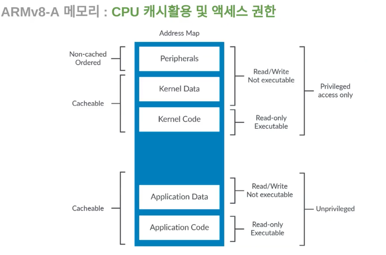

# 05.ARMv8-A 메모리 구조와 테스트

### ARMv8-A 메모리 구조

 <ARMv8-A 메모리구조>

1. **Peripherals (주변 장치)**
   
   - 주변 장치(Peripherals)는 시스템의 주요 구성 요소로, 입출력(I/O) 장치나 타이머 등을 포함
   - 이러한 주변 장치는 메모리 맵의 특정 주소 범위에 할당, 이 주소 범위를 통해 주변 장치에 접근할 수 있음

2. **Kernel Data (커널 데이터)**
   
   - 커널 데이터 영역에는 운영체제 커널의 데이터가 저장됨. 운영체제는 시스템을 관리하고 제어하는데 사용되며, 커널 데이터 영역은 이러한 작업에 필요한 데이터 구조를 포함

3. **Kernel Code (커널 코드)**
   
   - 커널 코드 영역에는 운영체제 커널의 실행 코드가 저장됨. 이 코드는 프로세스 스케줄링, 메모리 관리, 디바이스 드라이버 등과 같은 운영체제 기능을 구현함

4. **Application Data (애플리케이션 데이터)**
   
   - 애플리케이션 데이터 영역은 사용자 응용 프로그램의 데이터를 저장함. 이 데이터는 각 프로세스의 상태나 정보를 나타내며, 프로세스 간에 분리되어야 함

5. **Application Code (애플리케이션 코드)**
   
   - 애플리케이션 코드 영역에는 사용자 응용 프로그램의 실행 코드가 저장됨. 이 코드는 사용자의 요구에 따라 기능을 수행하며, 각 프로세스마다 별도의 가상 주소 공간을 할당받아 실행됨

✔️ 주변 장치, 운영체제 커널, 응용 프로그램 등 각 요소가 메모리에 고유한 위치를 갖는 것은 시스템의 안정성, 보안 및 성능을 보장하는 데 중요하다!

