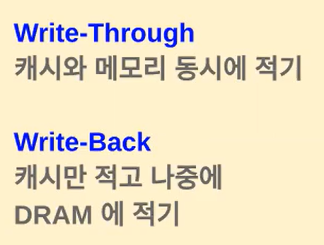

# 06.ARMv8캐시(Cache)

### ARMv8 캐시구조

1. **레벨(Level) 별 캐시**:
   
   - ARMv8 아키텍처에서는 여러 레벨의 캐시가 사용됨. 
   
   - 주로 L1, L2, L3 캐시로 구성 이 캐시들은 계층적으로 구성
   
   - L1 캐시는 보통 8~64KB 정도의 용량으로 CPU가 가장 빠르게 접근하게 되며, 여기서 데이터를 찾지 못하면, 이제 L2 캐시 메모리로 넘어감

2. **명령어 캐시(Instruction Cache)**:
   
   - 명령어 캐시는 프로세서가 명령어를 검색하고 실행하는 데 사용
   - 명령어를 캐시에 저장하여 프로세서가 빠르게 명령어를 가져올 수 있도록 함

3. **데이터 캐시(Data Cache)**:
   
   - 데이터 캐시는 프로세서의 데이터를 저장하는 데 사용.
   - 프로세서가 데이터를 읽거나 쓸 때, 이 데이터를 캐시에 저장하여 더 빠른 메모리 접근을 제공

4. **선호(Prefetch) 엔진**:
   
   - ARMv8 아키텍처는 데이터 및 명령어 캐시의 성능을 높이기 위해 선호 엔진을 포함
   - 이 엔진은 미리 읽어야 할 데이터 블록을 예측하여 캐시에 미리 로드하는 기능을 수행

5. **캐시 결합(Cache Coherency)**:
   
   - 멀티코어 시스템에서는 캐시 일관성이 중요
   - 캐시 일관성은 여러 개의 코어가 동일한 데이터에 접근할 때 데이터의 일관성을 유지하는 것을 의미

6. **캐시 크기와 구성**:
   
   - 각 레벨의 캐시는 크기와 조합에 따라 다양한 구성이 가능
   - 작은 크기의 L1 캐시는 빠른 접근 속도를 제공, 더 큰 크기의 L2 캐시는 더 많은 데이터를 저장할 수 있음

✖️

1. **ACP (Accelerator Coherency Port)**:
   
   - ACP는 ARM 기반 시스템에서 주변 장치와 캐시 사이의 데이터 일관성을 유지하기 위한 통로(HW)
   - 주변 장치가 캐시에 있는 데이터를 읽거나 쓸 때, ACP를 통해 이러한 동작이<u> 캐시 일관성을 유지</u>하며 수행됨

2. **SCU (Snoop Control Unit)**:
   
   - SCU는 멀티코어 시스템에서 **데이터 일관성을 관리**하는 역할 수행
   - SCU는 각 코어와 캐시 간의 **데이터 동기화와 캐시 일관성을 유지**하도록 도움

3. **ECC (Error Correction Code)**:
   
   - ECC는 메모리와 캐시의 데이터 무결성을 유지하기 위한 기술
   - 데이터 저장 시 일부 비트를 추가하여 **데이터 오류를 감지**하고 복구할 수 있는 기능을 제공함

4. AMBA 4 ACE: CCI를 활용한 캐시 동기화 처리

5. CCI: Cache Coherent Interconnect

`PIPT(Physical Index, Physical Tag)`: CPU 캐시의 동작 모드 중 하나인 캐시 일관성 모드를 나타내는 약어 이 모드는 캐시와 메모리 간의 데이터 일관성을 관리하는 방식을 의미
