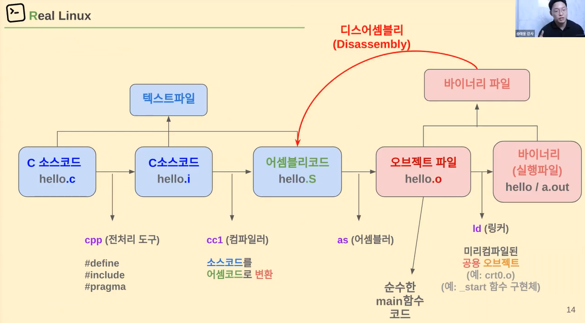

# 00.임베디드C프로그래밍




<br>

### 임베디드 시스템 C 프로그래밍: 최적화옵션,volatile,pragma,포인터 등


`GCC`는 GNU 컴파일러 모음 (GNU Compiler Collection)의 약자이다. GNU 프로젝트의 일환으로 개발되어 널리 쓰이고 있는 컴파일러.

`GNU`란? ➡️ GNU는 GNU’s not UNIX 의 재귀약자로, 리처드 스톨먼이 각종 자유 소프트웨어들이 돌아가고 번영할 수 있는 기반 생태계를 구축하기 위해 시작한 프로젝트

✔️ **리눅스에서 gcc, g++ 컴파일러를 이용하여 컴파일 시 다양한 최적화 옵션 사용이 가능**

- 각 옵션들은 매우 다양하기 때문에 일반적으로 이들을 묶어 간편하게 사용 가능한 **'-O1', '-O2', '-O3'** 옵션을 사용


`volatile`은 변수를 선언할 때 변수 앞에 붙일 수 있는데, 이 키워드는 해당 변수를 최적화에서 제외하는 역할을 한다.​

이게 무슨 말인지 알려면 C언어의 컴파일러가 최적화하는 방식에 대해서 알아야한다.

예를 들어서, 다음과 같은 코드가 있다고 가정한다.

```java
int i = 0;

while(i < 10) {
    i ++;
}
```

C언어의 컴파일러는 이 코드를 최적화 하기 위해 while문을 없애버리고 그냥 i에 10을 할당하는 최적화 방식을 가지고 있다. (반복되는 구문을 최적화한다고 생각하면 된다.)

​

일반적인 구문에서는 이러한 최적화가 큰 이득이 될 것이다.

하지만 만약 저 구문이 하드웨어 레지스터에 값을 쓰는 프로그램이라던가, 실행했어야 하는 구문이었다면 원하는 결과가 나오지 않을 것이다.

이를 방지하기 위해서 사용되는 변수가 바로 volatile 변수이다.

```java
volatile int i = 0;

while(i < 10) {
    i ++;
}
```

이와 같이 변수를 선언하면 컴파일러는 while문을 없애지 않고 제대로 돌려서 i에 10이라는 값을 할당하게 된다.

##### 💡 **쉽게 설명하자면,**

물건을 저장하는 상자를 생각해보자. 보통 우리는 상자에 물건을 넣고 꺼낼 수 있다. 하지만 때로는 누군가 다른 사람이 물건을 넣거나 빼는지 모를 때도 있다. 이럴 때 상자에 "주의: 누구나 언제든지 물건을 넣거나 빼도 됩니다!"라는 표시를 붙인다.

프로그래밍에서 `volatile` 변수는 이와 비슷한 역할을 한다. 일반 변수는 컴퓨터의 기억력인 메모리에 저장되어 프로그램이 값을 읽거나 쓸 수 있게 한다. 그런데 때로는 예상치 못한 일이 발생하여 이 변수의 값이 뜻하지 않게 변경될 수 있다. 

`volatile`을 붙인 변수는 마치 상자에 "주의" 표시를 붙인 것처럼, <mark>컴퓨터에게 이 변수의 값은 언제든지 바뀔 수 있다고 알려준다.</mark> 이렇게 하면 <u>컴퓨터는 이 변수를 최적화하거나 미리 계산해서 저장하는 것을 피하고, 항상 메모리에서 값을 읽거나 쓸 수 있게 된다.</u>

간단히 말하면, `volatile` 변수는 프로그램이 뜻하지 않게 값을 바꿀 수 있는 상황에서 컴퓨터가 값을 예측하거나 최적화하지 않도록 해주는 것이다.


