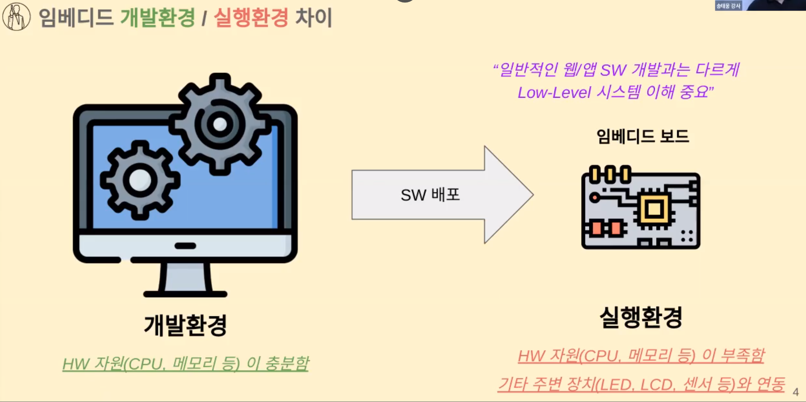
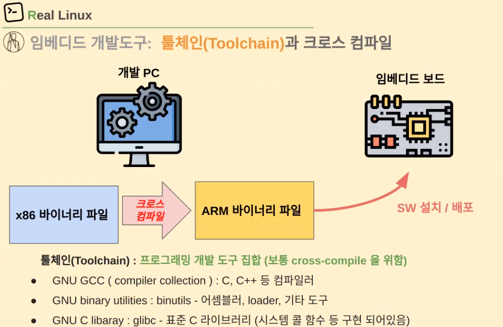
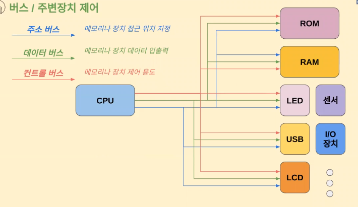
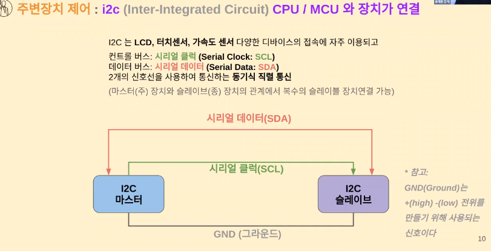
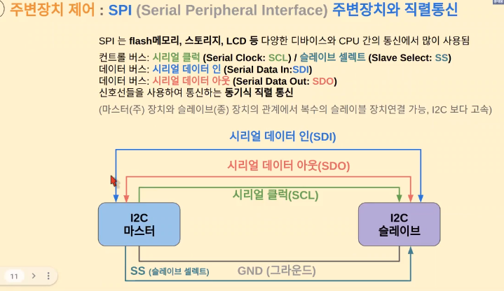
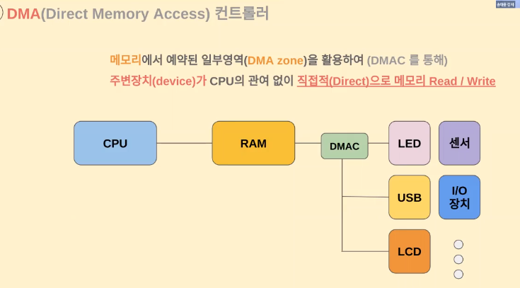
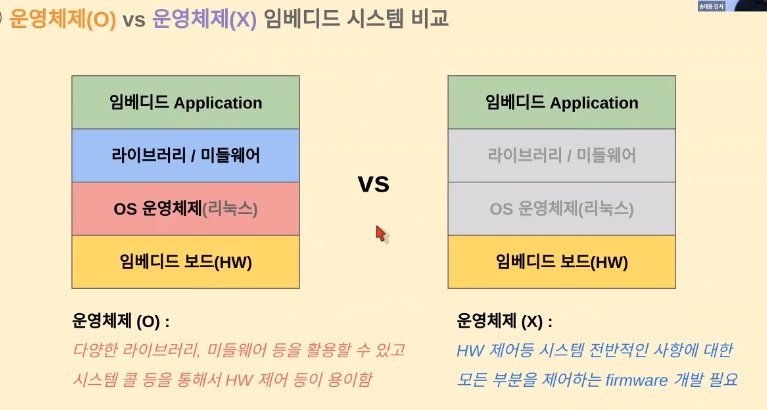

# 01.임베디드시스템

 

### 임베디드 시스템 아키텍쳐

`OS(운영체제,Operating System)`: 컴퓨터 HW를 관리하는 프로그램

- 어떻게?
  
  - 컴퓨터 HW를 사용하려는 사람들, 프로그래머들이 HW를 모르더라도 할 수 있도록
  
  - 컴퓨터 HW를 놀리지 않고 효율적으로 사용할 수 있도록

✔️ **OS가 하는 일?**

1. **사용자 application 관리**
   
   - **프로세스 관리**: 운영체제는 각 애플리케이션을 프로세스라는 실행 단위로 관리함 이를 통해 각 프로세스는 독립적으로 실행되며 필요한 자원(CPU 시간, 메모리 등)을 할당받음
   
   - **스케줄링**: 여러 개의 프로세스가 동시에 실행될 때, 운영체제는 CPU 시간을 효율적으로 분배하기 위해 프로세스 스케줄링을 수행. 이는 어떤 프로세스가 얼마나 오랜 시간 동안 실행되는지를 결정하는 과정
   
   - **메모리 관리**: 운영체제는 메모리를 관리하여 각 프로세스가 필요로 하는 메모리 공간을 할당하고, 메모리 영역의 충돌을 방지. 또한, 가상 메모리를 통해 물리적인 메모리보다 큰 공간을 다룰 수 있도록 지원
   
   - **파일 시스템 관리**: 파일을 저장하고 조직화하기 위한 파일 시스템을 관리사용자와 애플리케이션은 파일 시스템을 통해 데이터를 읽고 쓸 수 있음

2. **HW 자원 관리 (cpu, RAM, disk 등)**
   
   - **CPU 관리**: 여러 프로세스가 CPU를 공유하면서 실행되는데, 운영체제는 프로세스 스케줄링을 통해 CPU 시간을 분배함. 또한 중요한 작업을 처리하는 우선순위를 관리.
   
   - **메모리 관리**: 운영체제는 시스템의 물리적인 메모리(RAM)를 효율적으로 관리하여 프로세스에게 필요한 메모리 공간을 할당하고 해제
   
   - **입출력(I/O) 관리**: 하드웨어 장치와의 상호작용을 관리 사용자 및 애플리케이션이 키보드, 마우스, 디스크 등과 데이터를 주고받을 수 있도록 함
   
   - **파일 시스템 관리**: 하드 디스크와 같은 저장 장치에서 데이터를 읽고 쓰는 작업을 관리합니다. 파일의 생성, 삭제, 복사 등을 처리

✔️ **OS의 구성**

- **Core 부분**
  
  - **PM(process management)**: 프로세스의 생성, 스케줄링, 실행 및 종료와 관련된 작업을 처리
  
  - **MM(memory management)**: 시스템의 물리적인 메모리를 관리하며, 가상 메모리와 물리 메모리 간의 매핑을 관리하여 프로세스가 메모리를 효율적으로 사용할 수 있도록 함
  
  - irq / 예외처리, locking
    
    - 인터럽트: HW 전기적 신호(ex. USB, SSD, Network card)
    
    - 예외(exception): 시스템콜, 페이지 폴트 등

- I/O 처리
  
  - **네트워크 (L4: TCP, L3: IP, L2: DD)**: 네트워크 통신을 관리하며, 다양한 프로토콜 레이어(Layer 2: 데이터 링크, Layer 3: 네트워크, Layer 4: 전송)에 따른 데이터 전송을 처리
  
  - 스토리지 (VFS/FS/Block): 파일 시스템 관리와 블록 장치에 대한 접근을 관리하여 데이터를 저장하고 관리. 가상 파일 시스템(VFS)은 다양한 파일 시스템을 표준화된 인터페이스로 관리
  
  - 디바이스 드라이버 (i2c, SPI, GPIO 등): 다양한 하드웨어 장치를 제어하기 위한 드라이버를 관리

- 기타: security, tools, sounds .. 

 

### 인터럽트 및 I/O 장치 이해

운영체제에서 인터럽트(Interrupt)는 하드웨어나 외부 이벤트로부터 발생하는 신호로, 즉각적인 처리가 필요한 상황을 나타냄

하드웨어 인터럽트는 시스템의 CPU에게 특정한 작업이 발생했음을 알리는데, 이러한 상황에서의 처리 과정을 **전반부 작업**과 **후반부 작업**으로 나눌 수 있음

1. **전반부 작업 (Top-half, TH)**
   전반부 작업은 하드웨어 인터럽트가 발생하면 가장 먼저 처리되는 부분으로, 빠른 응답이 필요한 작업을 처리
   
   - **하드웨어 인터럽트 처리**: 하드웨어에서 발생한 인터럽트 신호를 감지하고 이를 처리하는 부분 예를 들어, 네트워크 카드가 데이터를 수신하거나, 디스크 컨트롤러가 데이터 전송을 완료했을 때 발생하는 인터럽트를 처리합
   - **인터럽트 서비스 루틴 실행**: 해당 인터럽트에 대한 처리를 위한 인터럽트 서비스 루틴(Interrupt Service Routine, ISR)을 실행. 이는 특정한 하드웨어 인터럽트에 대한 실제 작업을 수행하는 코드임.
- 전반부 작업은 빠르게 실행되어야 하기 때문에 간결하고 빠른 코드가 필요하며, 긴 작업이나 지연을 허용하지 않음(보통 작업량 적음)
2. **후반부 작업 (Bottom-half, BH)**
   전반부 작업에서 실제 인터럽트 처리를 완료한 후, 더 많은 작업이나 복잡한 처리가 필요한 경우 후반부 작업으로 이어짐. 후반부 작업은 전반부 작업 이후에 비동기적으로 처리되며, 시스템의 다른 부분과 동시에 실행될 수 있음.
   
   - **소프트 인터럽트 처리 (Softirq)**: 하드웨어 인터럽트와는 다르게 소프트웨어에서 발생하는 인터럽트로, 전반부 작업 후에 처리되어야 하는 작업을 수행. 네트워크 패킷 처리, 타이머 이벤트 등이 여기에 해당
   - **Tasklet**: 소프트 인터럽트와 유사한 개념으로, 일반적으로 더 가볍고 빠른 처리를 위해 사용됨.
   - **Workqueue**: 비동기 작업을 수행하기 위한 큐로, 보다 복잡하고 시간이 오래 걸리는 작업을 비동기적으로 처리할 때 사용됨.

후반부 작업은 전반부 작업과는 달리 상대적으로 더 많은 시간과 리소스를 소비할 수 있음

이로 인해 전반부 작업에서는 빠른 응답성이 보장되고, 후반부 작업에서는 비교적 더 복잡하고 시간이 오래 걸리는 작업을 처리할 수 있게 됨

