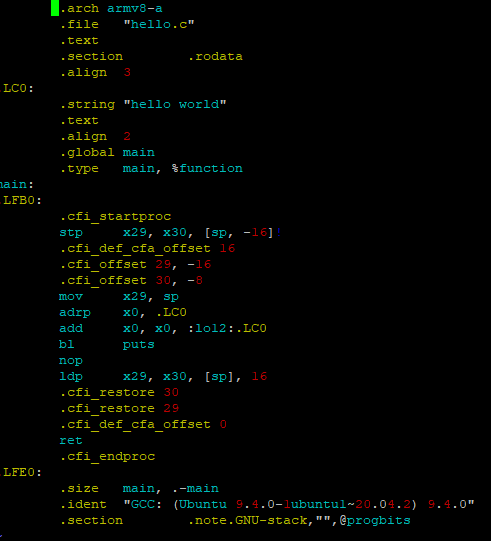

# 02. ARM어셈블리 프로그래밍

### ARM 주요 인스트럭션 정리

##### 💡메모리 인스트럭션

**LDR**(메모리의 내용을 Load): (주소에 해당되는) 메모리 값을 ➡️ 레지스터에 LOAD로드

- 메모리에서 데이터를 읽어와 레지스터에 저장

- 프로세서가 메모리에서 값을 가져와 레지스터에 넣는 작업을 의미

- 예를 들어, 변수나 상수 값을 레지스터에 로드하여 계산하는 데 사용될 수 있음

**STR**(메모리에 Store): 레지스터에 있는 값을 ➡️ (주소에 해당되는) 메모리 공간에 Store 저장

- 레지스터의 값을 메모리에 저장하는 역할

- 프로세서가 계산된 값을 메모리에 저장하는 작업을 의미

- 저장된 값은 나중에 필요한 경우 다시 로드하여 사용할 수 있음

**LDP**(Load Pair): (주소에 해당되는) 메모리 값을 ➡️ 레지스터 2개에 Load 로드

- 메모리에서 연속된 두 개의 데이터를 읽어와 두 개의 레지스터에 저장, 데이터가 연관된 형태로 저장되어 있는 경우 유용하다

- 배열의 요소를 두 개씩 읽어와 연산을 수행하는 경우에 사용될 수 있음

**STP**(Store Pair): 레지스터 2개에 있는 값을 ➡️ (주소에 해당되는) 메모리 공간에 Store 저장

- 두 개의 레지스터에 있는 데이터를 연속된 메모리 위치에 저장하는 역할,

- LDP와 유사하게, 데이터가 연관된 형태로 저장되어 있는 경우 사용됨

- 계산된 결과를 두 개씩 연속된 메모리 위치에 저장하는 경우에 사용될 수 있음

#상수 : 바이트 값

[ 주소 ] : [ ] 대괄호 안의 주소값 기준의 메모리 공간 액세스

[ 레지스터, #-16 ]! : 레지스터내 주소값 - 16 바이트 후 해당 주소 메모리 공간 액세스

[ 레지스터 ] #16 : 해당 주소 메모리 공간 액세스 후 16바이트를 더함

✔️ 예시 1) STR        X0, [X1]   

- "X0 레지스터 값을 X1 레지스터 내 주소 해당되는 메모리 공간에 저장 한다"

✔️예시 2) LDR        X0,  [X1]   

-  "X1 레지스터 내 주소 해당되는 메모리 값을X 0 레지스터에 로드 한다"

✔️예시 3) STP        X0, X1, [SP, #-16]!    

- "x0와 x1 레지스터값을 스택 - 16 바이트 공간에 저장 한다. "

✔️예시 4) LDP        X0, X1, [SP], #16     

- "스택에 있는 내용을 pop 하여 x0, x1 에 차례차례 로드한다"

##### 💡 ARMv8 기본 인스트럭션

**MOV** : 레지스터에 값 옮기기

- 예: mov x29, sp  “sp레지스터 값을 x29레지스터에 저장”

**SVC (Supervisor Call)** : 시스템콜 발생 (exception 발생)

- 예: svc 0 

**RET**  : 함수 복귀(return) 하는 명령어

##### 💡 함수 호출(call) 인스트럭션 이해하기

**B**: Branch “해당 주소로 점프 (pc값 변경됨)"

- 예: B 0xaaaaaaaaa650

**BL**: Branch with Link “복귀(return)주소를 x30(LR)레지스터에 저장해두고 점프”

- 예: bl  0xaaaaaaaaa650 <<puts@plt>>

**BR**: Branch indirect “레지스터에 있는 주소값으로 점프”

- 예: br x1

**BLR**:  Branch indirect with Link “복귀(return)주소를 x30(LR)레지스터에 저장해두고 레지스터 주소로 점프”

- 예: blr x1

<br>

### ARM 어셈블리 프로그래밍 실습

##### 💡 ARMv8 주요 레지스터

`레지스터`: 휘발성으로 데이터를 저장하는 공간

- 휘발성 덕분에 프로그램을 메모리에 올렸다가 CPU에서 실행하면 굉장히 빨리 처리할 수 있음

**💡코드(함수)실행 주요 레지스터**

- pc(Program Counter) “**다음실행할 명령어 주소**를 담는 레지스터”

- sp(Stack Pointer) “스택의 최상위 주소: **현재 사용중인 공간 끝** 주소”

- fp (x29) (Frame Pointer) “함수 단위로 스택의 시작주소: **함수단위 땅 시작**주소”

- lr (x30) (Link Register) “함수가 끝나고 돌아갈주소를 저장: **Return Adress**”


##### 💡함수인자 처리전용 레지스터

- x0 “**함수 첫번째 인자**를 담는 용도로 쓰이는 레지스터”

- x1 “**함수 두번째 인자**를 담는 용도로 쓰이는 레지스터”

- w0~w30 "x0~x30와 동일한 레지스터로 32bit 크기 레지스터로 나눠쓸때 사용"

- x0 "**함수 리턴값**를 담는 용도로 쓰이는 레지스터"

- x0~x7 "**함수 인자**를 담는 용도로 쓰이는 레지스터"

- x8 "시스템콜 넘버 저장용 / 리턴값 클때 해당 메모리 위치 주소값 적는 용도"

- x16~x17 "인트라 프로시저 레지스터: 라이브러리 함수 호출시 활용"

- x29 (Frame Pointer) "함수 단위로 스택의 시작주소: **함수단위 땅** 시작주소"

- x30 (Link Register) "함수가 끝나고 돌아갈주소를 저장: **Return Adress**"

- v0~v31 "FP / SIMD 전용 레지스터"

- Bn : Byte(8bit), Hn : Half(16bit), Sn : Single(32bit), Dn : Double(64bit), Qn : (128bit)

##### 💡 C코드를 어셈블리 코드로 변환

1. 구성하려고하는 로직을 먼저 C 코드로 작성하고

2. gcc -S 를 통하여 어셈코드로 변환시킨다

3. 그 이후에 생성된 어셈코드를 수정하여 원하는 작업할 수 있다블리 코드로 변환# 예제 C 코드

```bash
$ vim hello.c
```

```c
#include <stdio.h>

void main()

{

  printf("hello
world\n");

}
```

```bash
$ cat hello.c

어셈코드로 변환

$ gcc -S hello.c

$ vim hello.s
```




