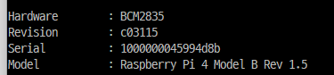
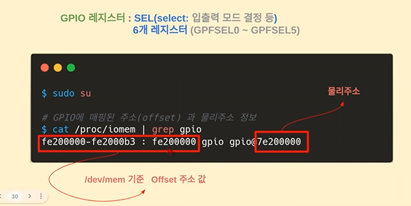
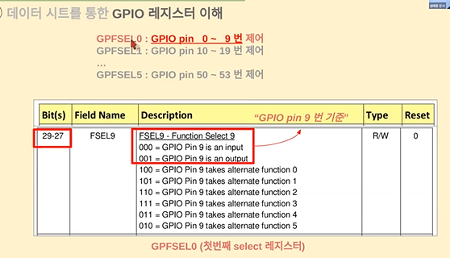
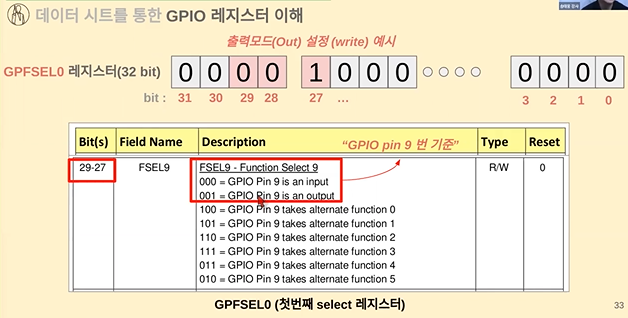
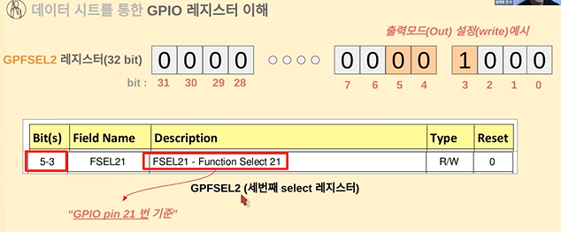
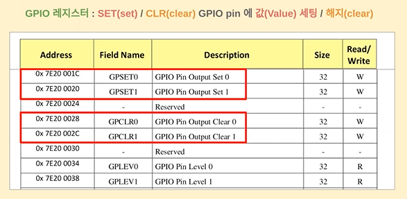
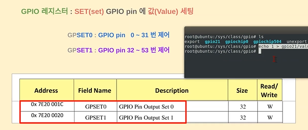
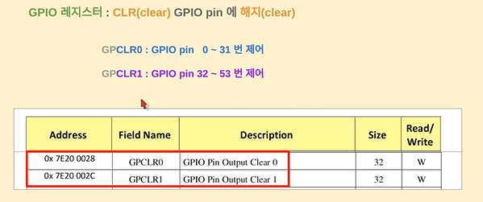
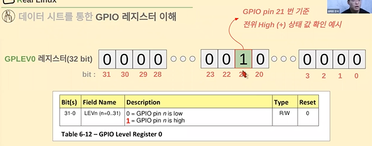

# 04.ARM디바이스 제어 실습

### 디바이스 제어방법: syscall,proc,sys 등

비트연산

<br>

### 데이터시트 해석: GPIO 레지스터 이해

💡 `GPIO`란?

라즈베리파이 같은 임베디드 보드는 내부에 MCU 칩이 있고 프로그램 해서 외부 장치들로부터 센서의 신호를 읽거나 제어를 위해 출력 신호보냄

이때 **입출력 신호를 주고 받을 수 있는 핀**들을 GPIO(General Prupose Input/Output)이라고 함

- 외부 장치와 입출력 신호를 주고 받는 핀

- GPIO 핀 제어를 위해 임베디드 보드 내에 레지스터(Register)에 값을 입력하여 사용

- 일반적으로 LED 구동 전력 정도의 파워를 공급

- GPIO는 MCU가 외부 세계와 통신하는 방식이고, 모든 보드는 다양한 수의 I/O를 사용하여 외부 주변 장치를 구동하거나 여러 유형의 통신 주변 장치(UART, USB, SPI 등)를 통해 데이터를 교환

```bash
cat /proc/cpuinfo
```



https://datasheets.raspberrypi.com/bcm2835/bcm2835-peripherals.pdf

데이터시트에서 제일 중요한 것은 레지스터를 어떤 규칙으로 input을 입력했을 때 output이 나오는지가 중요! (레지스터를 어떻게 컨트롤하면 어떻게 할 수 있는지)


Field Name 에 있는 레지스터가 커버할 수 있는 레지스터 범위가 있음







29-27 ➡️ 27, 28, 29번째 핀을 선택할 수 있다



GPIO기준 21번째 핀 을 설정하는 방법 



하나의 레지스터가 GPIO핀 한개를 컨트롤하는게 아니라 여러개를 제어함(보통 32개씩)







✔️ 데이터시트에 오타 있음

<br>

### 디바이스 제어 프로그래밍: GPIO 기본제어


나머지는 C 실습

<br>

### 디바이스 드라이버 프로그래밍 실습: I2C 및 SPI


