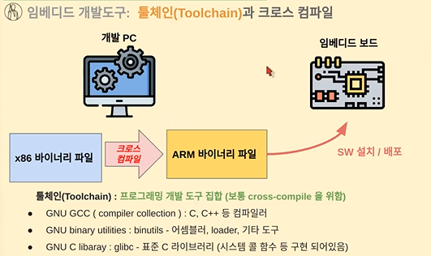
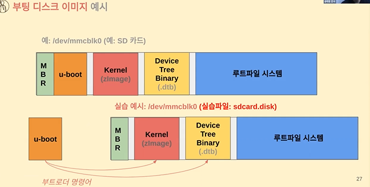
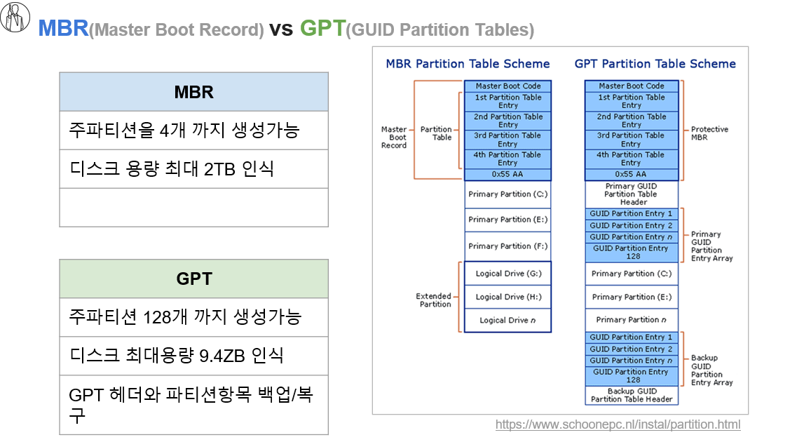
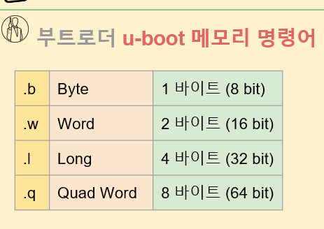

# 06.툴체인(Toolchain)와 부트로더

### 툴체인(Toolchain) 이해와 실습준비

리눅스 포팅(Linux Porting) 작업: Qemu ARM vexpress

부트로더(Bootloader) 명령어 실습: u-boot

`QEMU`: 가상 임베디드 보드환경

 

### 부트로더(Bootloader) 명령어 실습: u-boot

