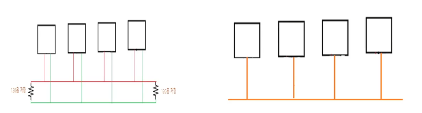
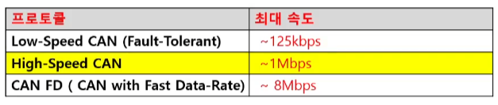
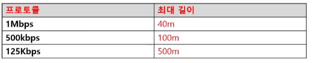
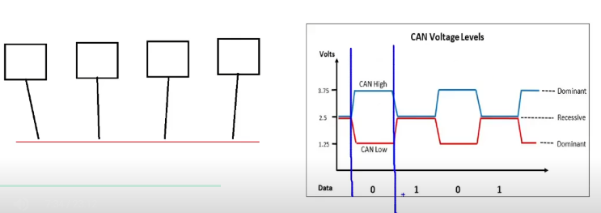
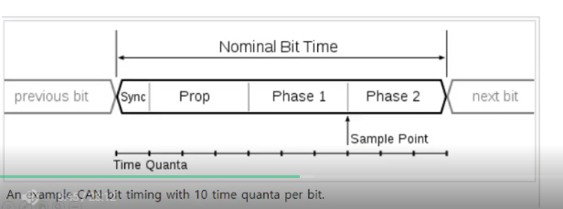
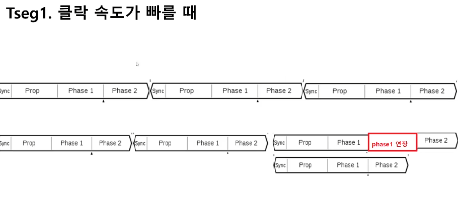
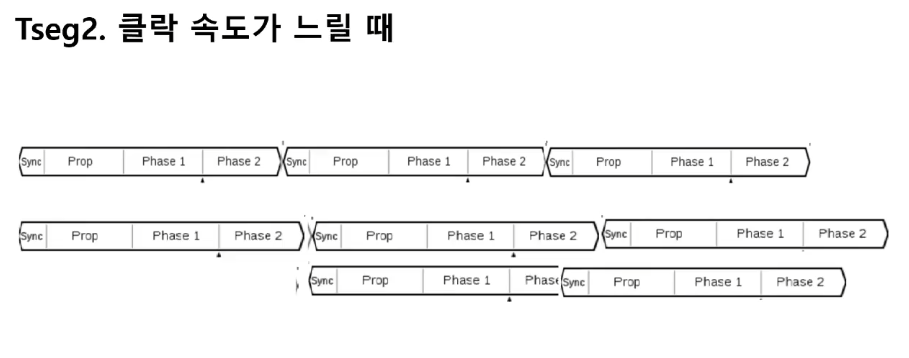

# CAN통신01_통신속도:BaudRate

- Baud Rate: 통신속도

- 단위: bps (bit per second) - 1초에 몇 bit의 data를 보낼 수 있는지 말해주는 척도

- 버스에 참여하고 있는 제어기들은 모두 같은 **baud Rate**으로 통신해야 함
  (baud Rate는 현대차 같은 완성차 회사에서 설정 -> `CAN DB`)

✔ 현대차 - 상용차 바디편의제어 개발 / 모빌리티 샤시시스템 통합제어

    -> CAN DB 발행 및 CAN 통신 사양 개발

✔ 모비스 - (전자제어랩) BDC 시스템 / CCU 시스템 설계 / IVI 자동화 평가

    -> CAN 개발

✔ 원래 can통신 전선은 두 줄이지만 편의상 한 줄로 표현하겠음

✔ High - Speed CAN 을 쓰면 보통 `500kbps`정도라고 생각하면 됨

✔ 속도가 빠르면 빠를수록 최대 길이가 짧아져야함 (아니면 에러생김)

✔ 답장을 하기도 전에 신호가 도착할 수도 있기 때문

ACK - 송신자가 메세지를 보냈을 때 수신자는 ACK에 대한 답을 해야함

### Sampling Point & Synchronization

Sample Point: 하나의 비트 값이 0인지 1인지 판단하는 지점을 의미. 단위는 %

- 이것도 OEM에서 Spec으로 정해준다

- Sampling Point에 따라서 똑같은 Baud rate이라도 Can Controller SW 구현 할때 셋팅하는 값이 달라진다.

- CAN Simulation 장비 사용할 때 Baud rate과 함께 Sampling Point도 셋팅해서 사용해야 함

-  CAN Controller 로 제공되는 클락속도에 따라 Time qunta라는 것이 계산됨
  
  - time qunta: 1 / CAN Clock

- CAN에서는 1 bit를 아래 그림처럼 `Sync`, `TSEG_1`,`TSEG2` 3개의 구간으로 분류
  
  - `Sync`, TSEG_1 (Prop, Phase 1으로 구분), TSEG2 (Phase 2)

- TSEG1, TSEG2의 길이를 세는 단위는 Time Qunta 임

- CAN Clock 속도를 얼마로 할건지 까지도 OEM에서 정해주기도 함

### TSEG1, TSE2의 역할 설명 및 SJW에 대하여

- SJW: Synchronization Jump Width
  
  - 늘리고 줄일 수 있는 최대의 길이 (제조사에서 정해줌)

CAN 통신은 모든 메세지가 브로드캐스트 방식으로 보내지고 모두 공통된 전선 사용하여 통신 ➡ sink가 맞아야함

sync 맞추는법

1. 1 bit의 시작 지점을 sync라 부르는데

2. 속도가 빠른 제어기 입장에서 빠르다고 생각되면 TSEG1이 빠르면 TSEG2 연장해줌(위에 빨간색)

좀 당겨줌

--- 

### 요약

- CAN 통신 속도의 단위를 Baud Rate이라고 한다.

- 해당 네트워크에 참여하는 모든 제어기들은 모두 통일된 Baud Rate를 사용해야 한다.

- Baud Rate를 얼마로 할 건지는 OEM(완성차회사)에서 지정하여 CAN DB에 나타낸다.

- 캔 프로토콜은 크게 Low - Speed CAN, High - Speed CAN, CAN FD 3가지 종류로 나뉘며

- 각 프로토콜 별로 최대 속도의 차이가 있다.

- 물리적인 버스(전선)의 최대 길이에 따라 최대속도에 한계가 있다.

- Sampling Point 라는 것이 있다. 단위는 % (이것도 OEM에서 정해줌)

- 하나의 bit는 Sync, Tseg1, Tseg2라는 것으로 나뉘고 이것들은 모두 여러 개의 time qunta로 구성됨

- Tseg1, Tseg2의 값을 적절하게 정함으로써 샘플링 포인트 값을 조절할 수 있다.

- Tseg1, Tseg2을 얼마로 할지도 제조사에서 정해주기도 함

