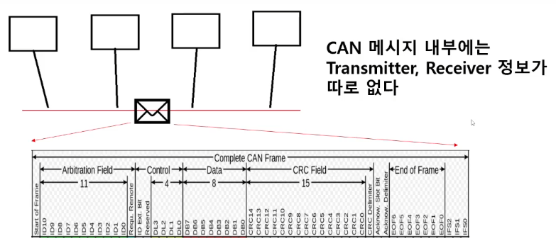
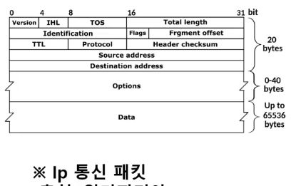
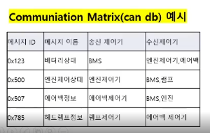

# CAN통신02_메세지의ID

✔ CAN 메세지 내부는 위에 직사각형 내부처럼 생김

Arbitration Field, Control, Data.. 등을 `필드` 라고함

✔ CAN 메세지 내부에는 Transmitter(보내는 제어기), Receiver(받는 제어기) 정보가 따로 없음 ➡ 즉 source Adress, Desitnation Adress 가 없다!

➡ 일반적인 Ip 통신 패킷에는 source Adress, Desitnation Adress 가 있다는 걸 확인 가능

그래서 아 이 메세지가 누가 보냈구나 이런 정보를 확인할 수 있음

⭐**but** CAN통신에서 이런식(source Adress, Desitnation Adress 가 없는 형태)으로 하면 모든 전송이 브로드캐스드 방식으로 됨 

➡ 받는 제어기 입장에서는 받은 메세지에 대한 정보(누가 줬는지, 어떤 내용을 담은건지)를 파악할 수 없음

➡ 이를 해결하기 위해 CAN에서는 **` 메세지의 ID`** 를 활용

##### 메세지의 ID

- 캔에서는 메세지 마다 ID를 적는 구간이 있음

- 메세지를 수신받은 제어기들은 이 메세지가 무슨 메세지인지 누가 보낸건지 확인 필요
  
  ➡ 그것을 구분하기 위해 사용하는게 메세지의 ID

- ID별로 메세지의 이름을 붙이고, 그 메세지를 누가 보낼건지를 OEM에서 사전에 정의해둠

- 이런 정보가 담겨있는 자료를 CAN DB, CAN database, Communiation Matrix(=K-Matrix) 등으로 부름

 *보통 CAN ID 표현할 때 16진수 사용*

✔ 실제로는 하나의 제어기가 다양한 ID의 메세지를 보냄

✔ **특정한 메세지를 보내는 제어기는 하나여야함!**

**CAN통신에서 메세지의 형태를 id의 길이에 따라서 메세지를 2가지 포멧으로 구분**

- Standard Format: 11bit

- Extended Format: 29bit

✔ 하나의 제어기에서는 포맷 혼용해서 쓸 수 있음

---

## 🔗 요약

- 캔 메세지에는 ID가 있다.

- 각 ID 별로 메세지의 이름, 메세지 송신제어기, 수신제어기 등을 약속해두고, 이 약속에 따라 실제로 제어기 SW를 구현하게 됨

- 위와 같은 약속이 적혀있는 자료를 CAN DB, CAN database, Communiation Matrix(=K-Matrix) 등으로 부름
  
  - 이것을 만드는 역할은 완성차(OEM) 회사이다.

- 이러한 CAN DB는 해당 네트워크에 참여하는 제어기들끼리만 통용되는 약속이고 CAN이라는 통신 자체에 대한 스펙은 아님
  
  - 차종마다, 회사마다 제각각 다른 것!

- 한편, 캔 메세지는 ID의 길이에 따라 2가지 타입의 포멧 존재
  
  - Standard Format: 11bit
  
  - Extended Format: 29bit
    
    - 하나의 네트워크에서 혼용 가능!

