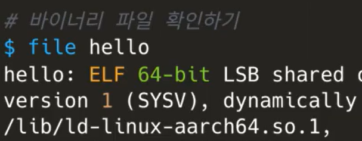
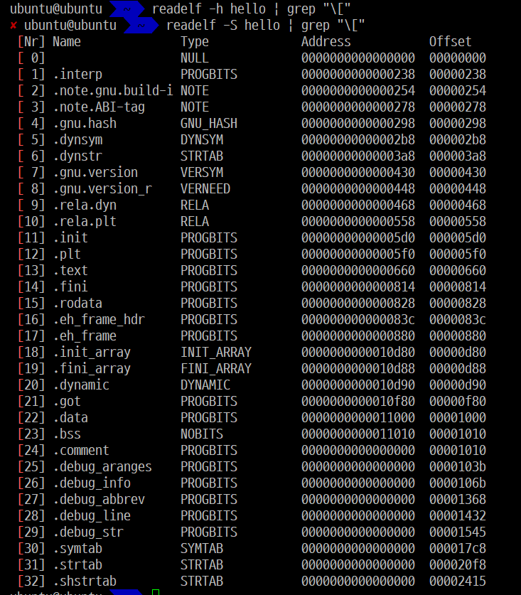
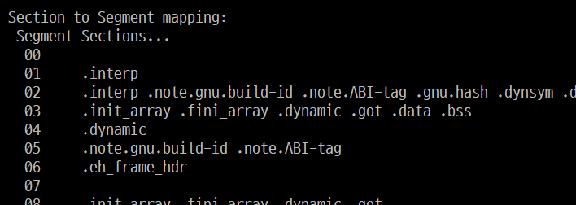
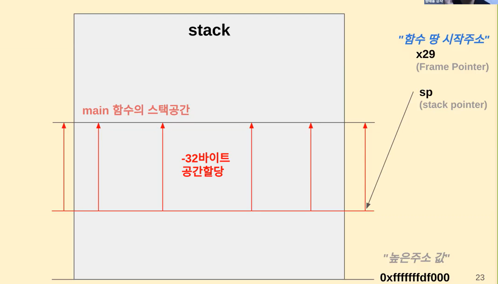

# ARM 소개와 ARMv8 아키텍쳐

### 1️⃣ ARM 소개와 ARMv8 아키텍쳐

**💡 ARM 이란 ?**

`ARM아케텍처`란 ARM이라는 회사가 개발한 마이크로프로세서 아키텍처

[x86과 ARM: 둘의 차이점](https://umanking.github.io/2023/03/05/processor-architecture-x86-arm/)

- `마이크로프로세서 아키텍처`란 CPU(=마이크로프로세서)를 개발하기 위한 <u>밑바탕</u>

- 특징
  
  - 가격이 싸고 소비전력이 적다.
    
    - 구조가 간단하고 라이센스로 받아 사용하므로 개발 비용 적게든다
    - ARM은 전세계 32비트 임베디드 RISC 시장의 약 75% 장악 (모바일 기기에서 각광 받음)
  
  - 고성능 32비트 RISC 프로세서
    
    - **RISC (Reduced Instruction Set Computer)**
      
      적은 수의 명령어를 수행하도록 설계된 마이크로프로세서
      
      복잡한 명령어를 제거하여 사용빈도가 높은 명령어 위주로 처리속도를 향상한 프로세서
      
      1. CPU의 명령어를 최소화하여 단순하게 제작된 프로세서
      
      2. 효율적이고 특화된 CPU 구조
      
      3. 하드웨어가 간단한 대신 소프트웨어가 복잡하고 크기가 커짐(컴파일러의 최적화가 요구됨)
      
      4. 하위 호환을 위해 에뮬레이션 방식을 채택, 호환성 부족
      
      5. 전력 소모가 적음
      
      6. 속도가 빠르고 가격이 저렴
      
      7. 용도에 최적화가 요구되는 환경에 사용
      
      8. 명령어의 길이가 같기 때문에 병렬 처리가 용이
  
  - 파이프라인 처리방식 (평균적으로 1사이클에 1명령)
    
    -  파이프라인 기법은 **단일 CPU를 이용하여 병렬처리 시스템과 유사한 연산속도를 만들기 위한 방법**
  
  - 많은 범용 레지스터와 효율적인 명령 세트 가짐
  
  - 명령 세트를 확장하기가 매우 용이한 구조
    
    - 보조 프로세서를 이용한 명령 세트 확장이 용이
    
    - 내부 구조가 철저하게 모듈식
    
    - 캐시 메모리나 MMU/MPU 또는 Jozelle, TrustZone등의 기능을 추가로 확장하는 것이 매우 용이
  
  - 명령처리 구조를 단순화
    
    - 모든 데이터 처리나 연산 명령은 내부 레지스터를 중심으로 이루어지며 레지스터와 메모리 사이의 데이터 이동은 별도의 로드(load) 및 스토어(store) 명령으로 수행

➡️ 요약하자면, ARM 아키텍처는 작고 효율적이며 다양한 장치와 응용 분야에 적합한 컴퓨터 프로세서 디자인

##### 🧐 내가 이것을 왜하고 있나

BSP 개발자는 하드웨어와 소프트웨어 사이의 다리 역할을 한다. 

ARM 아키텍처와 ELF 파일 실행과정을 이해하면 BSP 개발에 필요한 기본 개념과 도구를 습득할 수 있다. 그리고 더 효과적인 시스템 개발과 디버깅을 수행할 수 있다.

##### 💡프로그램 실행 원리


**⭐ARM 프로그램의 ELF 파일 실행 과정⭐**

1. **컴파일**: 소스 코드를 컴파일하여 오브젝트 파일을 생성. 이 오브젝트 파일은 기계어 코드와 데이터를 포함

2. **링크**: 여러 오브젝트 파일 및 라이브러리를 하나의 실행 가능한 ELF 바이너리로 링크. 이 과정에서 링커가 코드와 데이터 세그먼트를 정리하고, 심볼 테이블을 구축

3. **로딩**: ELF 바이너리 파일은 디스크에서 메모리로 로딩됨. 이때 운영 체제가 가상 메모리 주소 공간 내의 실행 파일에 메모리 공간을 할당하고 프로그램 코드와 데이터를 메모리로 복사.

4. **프로그램 시작**: ELF 파일의 실행 가능한 부분은 프로그램 `Entry poing adress`로 지정된 메모리 주소에서 실행. 이것이 프로그램의 시작 지점.

5. **명령어 해석 및 실행**: CPU는 메모리에서 명령어를 읽어들이고 해석. ARM 아키텍처에서는 `Instruction Pipline(명령어 파이프라인)`을 통해 명령어를 순차적으로 실행.
   
   - `pipline`: 하나의 명령어가 실행되는 도중에 다른 명령어 실행을 시작하여 동시에 여러개의 명령어를 실행하는 기법 

6. **레지스터 및 메모리 상태 변경**: 프로그램 실행 중에 레지스터와 메모리의 상태가 변경됨. 이러한 변경은 명령어 실행, 데이터 연산, 제어 흐름 등에 따라 발생.

7. **예외 및 인터럽트 처리**: 프로그램 실행 중에 예외나 인터럽트가 발생할 수 있음. 이때 CPU는 예외 처리 루틴으로 분기하여 해당 예외나 인터럽트를 처리하고, 다시 프로그램으로 복귀.

8. **프로그램 종료**: 프로그램이 완료되거나 종료되면, 종료 코드 및 상태를 반환하고 운영 체제에 제어를 반환.

✔️ 여기서 disk는 <u>sd card</u> / memory는 <u>ram card</u> (2GB 4GB 8GB ... )

✔️ 소스코드가 바이너리코드(.exe)가 되는 과정 

1. 소스코드가 컴파일러를 통해 바이트코드(=바이너리코드) 로 됨
   
   ```bash
   gcc -o hello hello.c
   ```
   
   

2. 이 디스크에 저장이 된 내용이 메모리에 올라가는 것이 `load`
   
   - 메모리에 올라가는게 바이너리파일 전체가 올라가는게 아님(구동에 필요한 내용 위주)

3. 메모리에 올라온걸 cpu가 읽는걸 `fetch`
   
   해석 `decode` : cpu가 실행하기전에 인스트럭션이 어떤 인스트럭션인지 내부적으로 어떻게 구동되어야하는지 cpu가 알아야해서 해석함
   
   실행 `execute`

##### 💡ARM 프로그램(ELF) 실행과정 추적

> 🧐 **ARM아키텍처 공부를 할 때 ARM 프로그램(ELF) 실행과정 추적은 왜 공부하는 걸까?**
> ➡️ ELF 파일의 실행과정을 추적하면 프로그램이 메모리에 로드되고 어떻게 실행되는지 이해할 수 있음

**`ELF(Executable and Linkable Format)`**: 리눅스에서 실행 가능(Executable)하고 링크 가능(Linkable)한 File의 Format을 ELF

즉, 디스크에 저장되어 있던 프로그램이 메모리 영역에 올라가서 컴퓨팅 자원을 사용하여 서비스를 제공해주는 것

다양한 역할별 **섹션(section)들**로 구성됨 (.text , .data, .debug 등의 모음)

 *다양한 섹션들*

 *공통된 섹션을 묶은 세그먼트*

✖️ `링킹`:  프로그램에 필요한 오브젝트 파일들을 하나로 합치고 추가로 라이브러리까지 합쳐서 .exe라는 **`실행파일을 만드는 과정을 링킹(Linking)`**

- ELF에서는 프로그램이 실행될 때 메모리에 올라가야 할 각각의 부분들을 미리 정리하여 관리하다가 실행을 하게 되면 정리된 부분들(코드, 전역데이터, 읽기 전용 데이터 등등)을 메모리에 올리게 된다.

- 이렇게 메모리에 올라온 주소 공간의 .text 섹션(코드 영역)의 Instruction을 한 라인씩 실행하며 프로세스가 진행된다.

✔️ **ELF의 File Format 의 구조**


- `Linking View`가 relocatable file의 형식
  
  - 즉, Link 하기 전의 object file(*.o)은 Linking View
  
  - 나중에 Link 과정을 위해 다른 Object file하고 연결하려고 여러가지 정보들을 심어놓은 것

- Link가 끝난 후에 완전히 실행 가능한 형태가 된 ELF 형식을 `Execution View`

- 구조 설명
  
  - `ELF header`: 파일의 구성을 나타내는 로드맵과 같은 역할
  
  - `Section`: Linking을 위한 object 파일의 정보를 다량으로 가지고 있으며, 명령, 데이버, 심볼테이블, 재배치 정보 등이 담겨 있음
  
  - `Program header table`: 시스템에 프로세스 이미지를 어떻게 만들지 지시, 프로세스의 이미지를 만들기 위해 사용되는 파일은 반드시 프로그램 헤더 테이블 가져야하고 재배치 가능 파일의 경우는 없어도 됨
  
  - `Section header table` 파일의 섹션들에 대해 알려줌. 모든 섹션은 이 테이블에 하나의 entry를 가져야함
  
  - [ELF 파일 구조](https://bnzn2426.tistory.com/82)

<br>

### 2️⃣ARMv8 아키텍쳐: 명령어와 레지스터

##### 💡 가상메모리


**프로그램의 실행**

1. 파일 시스템에 존재하던 실행파일이 **메모리에 적재**된다는 의미
2. 프로그램이 **CPU를 할당받고 명령을 수행하고 있는 상태**

 파일 시스템에 있는 실행 파일이 메모리에 적재될 때, 실행파일 전체가 메모리에 올라가지 않는다. 일부분만 메모리에 올라가고 나머지는 디스크의 특정영역인 스왑 영역에 존재한다.


**프로세스 메모리 영역**

프로세스의 주소 공간은 **코드(code)**, **데이터(data)**, **스택(stack)**, **힙(heap)** 영역으로 구성된다. 이러한 주소 공간을 `가상 메모리 (또는 논리적 메모리: logical memory)`라고 부른다.

- **code 영역**
  사용자가 작성한 프로그램 함수들의 코드가 CPU에서 수행할 수 있는 기계어 명령 형태로 변환되어 저장되는 공간
  
  컴파일(compile) 타임에 결정되고 중간에 코드를 바꿀 수 없게 **Read-Only** 로 되어있다.

- **data 영역**
  전역 변수 또는 static 변수 등 프로그램이 사용하는 데이터를 저장하는 공간
  
  전역 변수 또는 static 값을 참조한 코드는 컴파일이 완료되면 data 영역의 주소값을 가르키도록 바뀐다. 전역변수가 변경 될 수도 있어 **Read-Write**로 되어있다.

- **stack 영역**
  호출된 함수의 수행을 마치고 **복귀할 주소** 및 **데이터**(지역변수, 매개변수, 리턴값 등)를 임시로 저장하는 공간
  함수가 종료되면 해당 함수에 할당된 변수들을 메모리에서 해제시킴 
  
  메커니즘은 자료구조(stack)에서 배운 LIFO(Last In First Out) 방법을 따른다. 컴파일 시 stack 영역의 크기가 결정되기 때문에 무한정 할당 할 수 없다. 
  
  따라서 재귀함수가 반복해서 호출되거나 함수가 지역변수를 메모리를 초과할 정도로 너무 많이 가지고 있다면 <u>stack overflow</u>가 발생한다.

- **heap 영역**
  힙 영역은 쉽게 말해서 '사용자에 의해 관리되는 영역'  흔히 동적으로 할당 할 변수들이 여기에 저장된다고 보면됨
  
   Heap 영역은 대개 '낮은 주소에서 높은 주소로 할당(적재)'

[프로세스 메모리 구조 (코드, 데이터, 스텍, 힙)](https://zangzangs.tistory.com/107)

[C 자료구조 메모리 공간, 스택(Stack), 힙(Heap), 데이터(Data)](https://cholink.tistory.com/16) 

##### 💡Stack 메모리 추적과 분석

stack 영역 ➡️ 함수 소출 시 생성되는 지역 변수와 매개 변수가 저장되는 영역. 함수 호출이 완료되면 사라짐



stack -> 가상 메모리 영역에 저장

stack 변수를 쓴다는 것은 지역 변수를 쓰는 것

높은 주소값에서 빼면서 할당하는 방식


x29 시작주소(frame pointer)

x30 돌아갈 주소

stack은 16바이트로 떨어지도록 할당(하드웨어가 처리할 수 있도록)

<br>

### 3️⃣FP와 SIMD

##### 💡 vector 레지스터만 (NEON은 X)


---

`전원이 인가된 이후로 helloworld를 찍기까지의 과정`

부트로더 bootloader

- 전원 공급시 가장 먼저 실행

- 시스템 하드웨어 초기화 + 메모리에 운영체제로딩

- 하드웨어 추가로 운영체제 실행 전 초기화 작업이 필요한 경우 -> 부트로더 실행

- 부트로더 수정/코드 추가 -> 하드웨어 및 운영체제에 대한 이해가 필요

-> 부트로더에 명령어 추가시 부트로더를 다양하게 사용가능

- 초기화 코드가 어셈블리로 작성되는 경우 어셈블리 코드에 대한 이해도 필요

ArmCore기준
