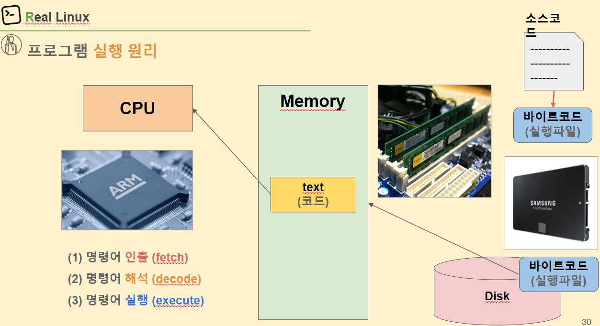

# ARM 소개와 ARMv8 아키텍쳐

### 1️⃣ ARM 소개와 ARMv8 아키텍쳐

**💡 ARM 이란 ?**

`ARM아케텍처`란 ARM이라는 회사가 개발한 마이크로프로세서 아키텍처

[x86과 ARM: 둘의 차이점](https://umanking.github.io/2023/03/05/processor-architecture-x86-arm/)

- `마이크로프로세서 아키텍처`란 CPU(=마이크로프로세서)를 개발하기 위한 <u>밑바탕</u>

- 특징 [ARM 마이크로프로세서 공부 정리](http://wooguystudy.blogspot.com/2019/02/arm.html)
  
  - 가격이 싸고 소비전력이 적다. -> 가격이 싸진 않은거같은디 
    
    - 구조가 간단하고 라이센스로 받아 사용하므로 개발 비용 적게든다
    - ARM은 전세계 32비트 임베디드 RISC 시장의 약 75% 장악 (모바일 기기에서 각광 받음)
  
  - 고성능 32비트 RISC 프로세서
    
    - **RISC (Reduced Instruction Set Computer)**
      
      적은 수의 명령어를 수행하도록 설계된 마이크로프로세서
      
      복잡한 명령어를 제거하여 사용빈도가 높은 명령어 위주로 처리속도를 향상한 프로세서
      
      1. CPU의 명령어를 최소화하여 단순하게 제작된 프로세서
      
      2. 효율적이고 특화된 CPU 구조
      
      3. 하드웨어가 간단한 대신 소프트웨어가 복잡하고 크기가 커짐(컴파일러의 최적화가 요구됨)
      
      4. 하위 호환을 위해 에뮬레이션 방식을 채택, 호환성 부족
      
      5. 전력 소모가 적음
      
      6. 속도가 빠르고 가격이 저렴
      
      7. 용도에 최적화가 요구되는 환경에 사용
      
      8. 명령어의 길이가 같기 때문에 병렬 처리가 용이
  
  - 파이프라인 처리방식 (평균적으로 1사이클에 1명령)
    
    - 파이프라인 기법은 **단일 CPU를 이용하여 병렬처리 시스템과 유사한 연산속도를 만들기 위한 방법**
  
  - 많은 범용 레지스터와 효율적인 명령 세트 가짐
  
  - 명령 세트를 확장하기가 매우 용이한 구조
    
    - 보조 프로세서를 이용한 명령 세트 확장이 용이
    
    - 내부 구조가 철저하게 모듈식
    
    - 캐시 메모리나 MMU/MPU 또는 Jozelle, TrustZone등의 기능을 추가로 확장하는 것이 매우 용이
  
  - 명령처리 구조를 단순화
    
    - 모든 데이터 처리나 연산 명령은 내부 레지스터를 중심으로 이루어지며 레지스터와 메모리 사이의 데이터 이동은 별도의 로드(load) 및 스토어(store) 명령으로 수행

➡️ 요약하자면, ARM 아키텍처는 작고 효율적이며 다양한 장치와 응용 분야에 적합한 컴퓨터 프로세서 디자인

##### 🧐 내가 이것을 왜하고 있나

BSP 개발자는 하드웨어와 소프트웨어 사이의 다리 역할을 한다. 

ARM 아키텍처와 ELF 파일 실행과정을 이해하면 BSP 개발에 필요한 기본 개념과 도구를 습득할 수 있다. 그리고 더 효과적인 시스템 개발과 디버깅을 수행할 수 있다.

##### 💡프로그램 실행 원리



**⭐ARM 프로그램의 ELF 파일 실행 과정⭐**

1. **컴파일**: 소스 코드를 컴파일하여 오브젝트 파일을 생성. 이 오브젝트 파일은 기계어 코드와 데이터를 포함

2. **링크**: 여러 오브젝트 파일 및 라이브러리를 하나의 실행 가능한 ELF 바이너리로 링크. 이 과정에서 링커가 코드와 데이터 세그먼트를 정리하고, 심볼 테이블을 구축

3. **로딩**: ELF 바이너리 파일은 디스크에서 메모리로 로딩됨. 이때 운영 체제가 가상 메모리 주소 공간 내의 실행 파일에 메모리 공간을 할당하고 프로그램 코드와 데이터를 메모리로 복사.

4. **프로그램 시작**: ELF 파일의 실행 가능한 부분은 프로그램 `Entry poing adress`로 지정된 메모리 주소에서 실행. 이것이 프로그램의 시작 지점.

5. **명령어 해석 및 실행**: CPU는 메모리에서 명령어를 읽어들이고 해석. ARM 아키텍처에서는 `Instruction Pipline(명령어 파이프라인)`을 통해 명령어를 순차적으로 실행.
   
   - `pipline`: 하나의 명령어가 실행되는 도중에 다른 명령어 실행을 시작하여 동시에 여러개의 명령어를 실행하는 기법 

6. **레지스터 및 메모리 상태 변경**: 프로그램 실행 중에 레지스터와 메모리의 상태가 변경됨. 이러한 변경은 명령어 실행, 데이터 연산, 제어 흐름 등에 따라 발생.

7. **예외 및 인터럽트 처리**: 프로그램 실행 중에 예외나 인터럽트가 발생할 수 있음. 이때 CPU는 예외 처리 루틴으로 분기하여 해당 예외나 인터럽트를 처리하고, 다시 프로그램으로 복귀.

8. **프로그램 종료**: 프로그램이 완료되거나 종료되면, 종료 코드 및 상태를 반환하고 운영 체제에 제어를 반환.

✔️ 여기서 disk는 <u>sd card</u> / memory는 <u>ram card</u> (2GB 4GB 8GB ... )

✔️ 소스코드가 바이너리코드(.exe)가 되는 과정 

1. 소스코드가 컴파일러를 통해 바이트코드(=바이너리코드) 로 됨
   
   ```bash
   gcc -o hello hello.c
   ```
   
   

2. 이 디스크에 저장이 된 내용이 메모리에 올라가는 것이 `load`
   
   - 메모리에 올라가는게 바이너리파일 전체가 올라가는게 아님(구동에 필요한 내용 위주)

3. 메모리에 올라온걸 cpu가 읽는걸 `fetch`
   
   해석 `decode` : cpu가 실행하기전에 인스트럭션이 어떤 인스트럭션인지 내부적으로 어떻게 구동되어야하는지 cpu가 알아야해서 해석함
   
   실행 `execute`

##### 💡ARM 프로그램(ELF) 실행과정 추적

> 🧐 **ARM아키텍처 공부를 할 때 ARM 프로그램(ELF) 실행과정 추적은 왜 공부하는 걸까?**
> ➡️ ELF 파일의 실행과정을 추적하면 프로그램이 메모리에 로드되고 어떻게 실행되는지 이해할 수 있음

**`ELF(Executable and Linkable Format)`**: 리눅스에서 실행 가능(Executable)하고 링크 가능(Linkable)한 File의 Format을 ELF

즉, 디스크에 저장되어 있던 프로그램이 메모리 영역에 올라가서 컴퓨팅 자원을 사용하여 서비스를 제공해주는 것

다양한 역할별 **섹션(section)들**로 구성됨 (.text , .data, .debug 등의 모음)

 *다양한 섹션들*

 *공통된 섹션을 묶은 세그먼트*

✖️ `링킹`:  프로그램에 필요한 오브젝트 파일들을 하나로 합치고 추가로 라이브러리까지 합쳐서 .exe라는 **`실행파일을 만드는 과정을 링킹(Linking)`**

- ELF에서는 프로그램이 실행될 때 메모리에 올라가야 할 각각의 부분들을 미리 정리하여 관리하다가 실행을 하게 되면 정리된 부분들(코드, 전역데이터, 읽기 전용 데이터 등등)을 메모리에 올리게 된다.

- 이렇게 메모리에 올라온 주소 공간의 .text 섹션(코드 영역)의 Instruction을 한 라인씩 실행하며 프로세스가 진행된다.

✔️ **ELF의 File Format 의 구조**


- `Linking View`가 relocatable file의 형식
  
  - 즉, Link 하기 전의 object file(*.o)은 Linking View
  
  - 나중에 Link 과정을 위해 다른 Object file하고 연결하려고 여러가지 정보들을 심어놓은 것

- Link가 끝난 후에 완전히 실행 가능한 형태가 된 ELF 형식을 `Execution View`

- 구조 설명
  
  - `ELF header`: 파일의 구성을 나타내는 로드맵과 같은 역할
  
  - `Section`: Linking을 위한 object 파일의 정보를 다량으로 가지고 있으며, 명령, 데이버, 심볼테이블, 재배치 정보 등이 담겨 있음
  
  - `Program header table`: 시스템에 프로세스 이미지를 어떻게 만들지 지시, 프로세스의 이미지를 만들기 위해 사용되는 파일은 반드시 프로그램 헤더 테이블 가져야하고 재배치 가능 파일의 경우는 없어도 됨
  
  - `Section header table` 파일의 섹션들에 대해 알려줌. 모든 섹션은 이 테이블에 하나의 entry를 가져야함
  
  - [ELF 파일 구조](https://bnzn2426.tistory.com/82)

<br>

### 2️⃣ARMv8 아키텍쳐: 명령어와 레지스터

##### 💡 가상메모리


**프로그램의 실행**

1. 파일 시스템에 존재하던 실행파일이 **메모리에 적재**된다는 의미
2. 프로그램이 **CPU를 할당받고 명령을 수행하고 있는 상태**

 파일 시스템에 있는 실행 파일이 메모리에 적재될 때, 실행파일 전체가 메모리에 올라가지 않는다. 일부분만 메모리에 올라가고 나머지는 디스크의 특정영역인 스왑 영역에 존재한다.


**프로세스 메모리 영역**

프로세스의 주소 공간은 **코드(code)**, **데이터(data)**, **스택(stack)**, **힙(heap)** 영역으로 구성된다. 이러한 주소 공간을 `가상 메모리 (또는 논리적 메모리: logical memory)`라고 부른다.

- **code 영역**
  사용자가 작성한 프로그램 함수들의 코드가 CPU에서 수행할 수 있는 기계어 명령 형태로 변환되어 저장되는 공간
  
  컴파일(compile) 타임에 결정되고 중간에 코드를 바꿀 수 없게 **Read-Only** 로 되어있다.

- **data 영역**
  전역 변수 또는 static 변수 등 프로그램이 사용하는 데이터를 저장하는 공간
  
  전역 변수 또는 static 값을 참조한 코드는 컴파일이 완료되면 data 영역의 주소값을 가르키도록 바뀐다. 전역변수가 변경 될 수도 있어 **Read-Write**로 되어있다.

- **stack 영역**
  호출된 함수의 수행을 마치고 **복귀할 주소** 및 **데이터**(지역변수, 매개변수, 리턴값 등)를 임시로 저장하는 공간
  함수가 종료되면 해당 함수에 할당된 변수들을 메모리에서 해제시킴 
  
  메커니즘은 자료구조(stack)에서 배운 LIFO(Last In First Out) 방법을 따른다. 컴파일 시 stack 영역의 크기가 결정되기 때문에 무한정 할당 할 수 없다.
  
  따라서 재귀함수가 반복해서 호출되거나 함수가 지역변수를 메모리를 초과할 정도로 너무 많이 가지고 있다면 <u>stack overflow</u>가 발생한다.

- **heap 영역**
  힙 영역은 쉽게 말해서 '사용자에 의해 관리되는 영역'  흔히 동적으로 할당 할 변수들이 여기에 저장된다고 보면됨
  
   Heap 영역은 대개 '낮은 주소에서 높은 주소로 할당(적재)'

[프로세스 메모리 구조 (코드, 데이터, 스텍, 힙)](https://zangzangs.tistory.com/107)

[C 자료구조 메모리 공간, 스택(Stack), 힙(Heap), 데이터(Data)](https://cholink.tistory.com/16) 

##### 💡Stack 메모리 추적과 분석

stack 영역 ➡️ 함수 호출 시 생성되는 지역 변수와 매개 변수가 저장되는 영역. 함수 호출이 완료되면 사라짐


stack -> 가상 메모리 영역에 저장

stack 변수를 쓴다는 것은 지역 변수를 쓰는 것

높은 주소값에서 빼면서 할당하는 방식


x29 시작주소(frame pointer)

x30 돌아갈 주소

stack은 16바이트로 떨어지도록 할당(하드웨어가 처리할 수 있도록)

<br>

### 3️⃣FP와 SIMD

##### 💡 vector 레지스터만 (NEON은 X)

✔️ **SIMD 란 ?**

SIMD란 **Single Instrument Mutliple Data** 라는 뜻으로 하나의 명령어로 여려개의 데이터를 처리할 수 있는 기술

- 일단 기본적인 특징은 우리의 CPU는 연산기를 여러개 가지고 있기 때문에, 이걸 여러개 쓰자는 것이다. 아래 그림과 같이, A0+B0, A1+B1, A2+B2, A3+B3 연산을 4번 할 것을 병렬로 한방에 더해버리자는 것이다.
  
  
  
  ➡️ 백터는 (x,y,z) 꼴로 보통 표시돼있는데 연산 3번 할것을 한번으로 줄일 수 있다는 것

✔️ `neon`은 ARM 아키텍처의 SIMD(Single Instruction, Multiple Data) 명령어 세트로, 벡터화된 연산을 지원하는 기능 ➡️ 즉, **하나의 명령어로 여러 개의 데이터를 동시에 처리할 수 있는 것을 의미**

🧐 **그럼 이게 왜 필요할까?**

ARM은 32비트 프로세서 (AArch32)에서 현재는 64비트 프로세서 모드(AArch64)를 지원하고 있다. 이게 무슨 말이냐 하면, 한번에 다루는 Data의 Address나 크기가 32bit혹은 64bit까지 한꺼번에 다루는 것이 가능하다는 뜻

그런데 문제는, 많은 경우에 (특히 멀티미디어 관련 - 이를 테면 오디오 코덱 이나 그래픽 관련에서 함수들) 이것 보다 작은 크기의 데이터를 대량으로 다루는 경우가 많다 😭

가령 이런 함수에서 많은 양의 8비트 데이터를 엄청나게 연산해야 하는데, CPU는 한꺼번에 64비트를 처리할 능력이 있는데, 고작? 8비트의 데이터를 복사 혹은 연산하기 위해서 한개 인스트럭션을 소모해야 한다면, CPU를 효율적으로 사용하고 있다고 말하기 힘들다...

이런 비효율의 문제를 해결하기 위해서, ARM社에서는 ARMv6에 작은 크기에 데이터를 여러개 처리하도록 해주는 기본적인 SIMD 명령어를 추가하게 된다. 이때는 8비트 혹은 16bit로 값들을 generic purpose register에 packed한 형태로 연산하도록 지원을 했었고, ARMv7이후에는 이 개념을 더 확장해서 이런 operation을 위해서 vector register를 두고, 명령어 세트와 해당 Architecture를 합쳐서 `네온(NEON)` 이라고 부르게 된다. 현재는 모든 Cortex-A 프로세서에서 지원하고 있다!


✔️ **부동소수점?**

컴퓨터에서 숫자를 표현할 때, 정수와 소수 부분을 나누어 저장해야 한다. 이 때, 실수를 다루기 위한 방식을 **부동소수점**이라고 함. 부동소수점은 소수점 위치를 움직여가며 숫자를 표현하는 방식

ARM 프로세서에서는 부동소수점 연산을 더 빠르고 효율적으로 처리하기 위해 `VFP`와 `NEON`이라는 두 가지 기술을 사용

1. **VFP (Vector Floating-Point):** 이는 부동소수점 연산을 더 빠르게 처리하기 위한 하드웨어 가속기 "Vector"라는 단어는 한 번에 여러 개의 데이터를 처리하는 것을 의미. VFP는 실수 계산을 효율적으로 하기 위한 하드웨어 부분.

2. **NEON SIMD (Single Instruction, Multiple Data):** NEON은 벡터화된 연산을 지원하는 기술로, 한 번의 명령어로 여러 데이터를 동시에 처리할 수 있다. 이것은 실수 연산을 비롯한 다양한 연산을 효율적으로 처리하는 데 사용된다.

✔️ **VFP는 주로 실수 연산에 특화되어 있고 개별 연산을 더 빠르게 처리하는 데 초점**을 맞추었으며, **NEON은 SIMD 기술을 활용하여 여러 종류의 데이터 연산을 병렬로 처리하여 더 효율적인 연산을 실현**

➡️ 따라서 ARM 프로세서에서 부동소수점 계산을 더 빠르고 효율적으로 처리하기 위해 VFP와 NEON을 함께 사용하며, NEON을 통해 병렬로 여러 연산을 처리할 수 있다. 이로써 속도와 효율성이 향상되며, 실시간 그래픽 처리나 과학/공학 연산 등에 많이 활용된다.

> **레지스터?**
> 
> 프로세서 내부에 위치한 작은 크기의 **메모리 유닛**
> 
> 레지스터는 프로세서가 데이터를 임시로 저장하고 연산을 수행하는 데 사용되며, 매우 빠른 속도로 데이터에 접근할 수 있음 CPU의 동작을 조정하고 명령어를 실행하기 위한 데이터 저장소로 볼 수 있다.


✔️ 해석이 중요해!

- MUL V0.8B, V0.8B V1.8B
  
  - MUL은 곱하기 / 오른쪽에서 왼쪽으로 읽는다
  
  - V0와 V1에 있는 레지스터 값을 곱해서 V0에 넣겠다

- 오른쪽에서 왼쪽으로 읽는다

- FADD 포인트 연산..? 실수값이 들어간다는 뜻인데 아무튼 ADD임

💡 해보기

> **MOV X0, #1** **SUBS X1, X0, X0**

1. **MOV X0, #1:** 이 명령어는 레지스터 X0에 숫자 1을 저장하는 역할 즉, X0 레지스터에 1이 저장

2. **SUBS X1, X0, X0:** 이 명령어는 X0 레지스터의 값과 X0 레지스터의 값을 뺀 결과를 X1 레지스터에 저장하면서, 동시에 연산 결과의 상태를 조사
   
   - **SUBS:** 두 개의 값을 빼는 명령어
   - **X1:** 연산 결과를 저장할 대상 레지스터
   - **X0, X0:** 두 번째와 세 번째 인자는 빼기 연산에 사용될 레지스터 여기서는 레지스터 X0의 값에서 X0의 값(즉, 1)을 빼게 됨

이때, 뺀 결과는 0이 되므로 X1 레지스터에 0이 저장 또한, 이 SUBS 명령어는 뺀 결과를 기준으로 네 가지 상태 비트(N, Z, C, V)를 설정

- **N (Negative):** 뺀 결과가 0보다 작기 때문에 N 비트는 1로 설정
- **Z (Zero):** 뺀 결과가 0이기 때문에 Z 비트는 1로 설정
- **C (Carry):** 빼기 연산에서 캐리가 발생하지 않았기 때문에 C 비트는 0으로 설정
- **V (Overflow):** 빼기 연산에서 오버플로우가 발생하지 않았기 때문에 V 비트는 0으로 설정

결과적으로 X1에는 0이 저장되고, 상태 비트들은 위와 같이 설정됨

<br>

### 4️⃣ AArch64 예외(Exception) 32/64 bit 프로그램

##### 💡상태레지스터(cpsr)와 익셉션(Exception) 모델


1. **CPSR (Current Program Status Register)**
   
   - CPSR은 ARM 아키텍처에서 사용되는 레지스터로, **현재 프로그램의 실행 상태**를 나타냄. ARM 아키텍처에서 CPSR은 특정 프로그램 상태 비트들을 포함하는 레지스터임
   - CPSR의 주요 역할은 프로세서의 상태와 조건 코드를 나타내는 데 사용됨. 이 레지스터는 다음과 같은 정보를 포함할 수 있다
     - **N (Negative) Flag**: 연산 결과가 음수일 경우 설정.
     - **Z (Zero) Flag**: 연산 결과가 0일 경우 설정.
     - **C (Carry) Flag**: 연산에서 캐리 발생시 설정.
     - **V (Overflow) Flag**: 연산 결과가 오버플로우가 발생했을 경우 설정.
     - **Q (Sticky Overflow) Flag**: SIMD 연산을 위한 추가적인 오버플로우 플래그.
     - **모드 (Mode) 비트**: 현재 프로세서 모드 (사용자 모드, 시스템 모드, 슈퍼바이저 모드 등)

2. **PC (Program Counter)**
   
   - PC는 프로그램 카운터로도 알려져 있으며, **현재 실행 중인 명령어의 주소**를 가리키는 레지스터. PC는 다음에 실행할 명령어의 주소를 저장하고 갱신하는 역할을 함
   - 프로그램이 실행될 때, PC는 처음 실행할 명령어의 주소로 초기화되며, 명령어가 한 번 실행될 때마다 자동으로 다음 명령어의 주소로 증가.
   - 분기 명령어나 점프 명령어가 실행되면 PC의 값이 변경되어 다른 부분으로 프로그램 흐름이 이동.
- CPSR은 연산 결과 및 상태를 확인하고 프로세서 모드를 관리하는 데 사용

- PC는 프로그램 흐름을 제어하고 다음 명령어의 주소를 저장하는 데 사용됨

? ㅠ ㅠ 

##### 💡익셉션 Exception 처리과정 추적

---

`전원이 인가된 이후로 helloworld를 찍기까지의 과정`

부트로더 bootloader

- 전원 공급시 가장 먼저 실행

- 시스템 하드웨어 초기화 + 메모리에 운영체제로딩

- 하드웨어 추가로 운영체제 실행 전 초기화 작업이 필요한 경우 -> 부트로더 실행

- 
